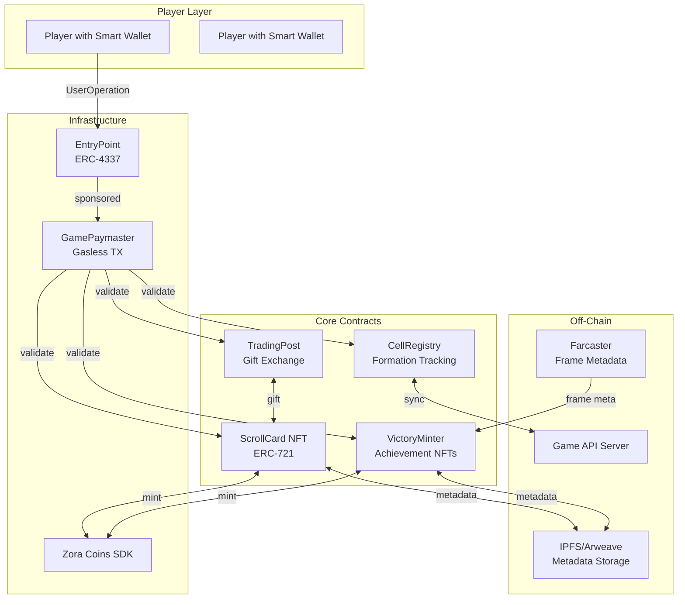
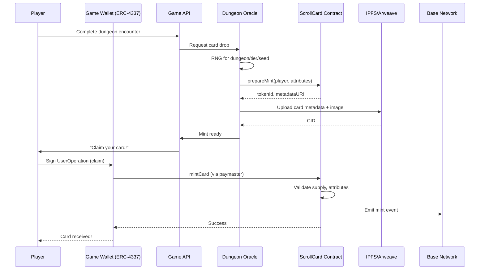
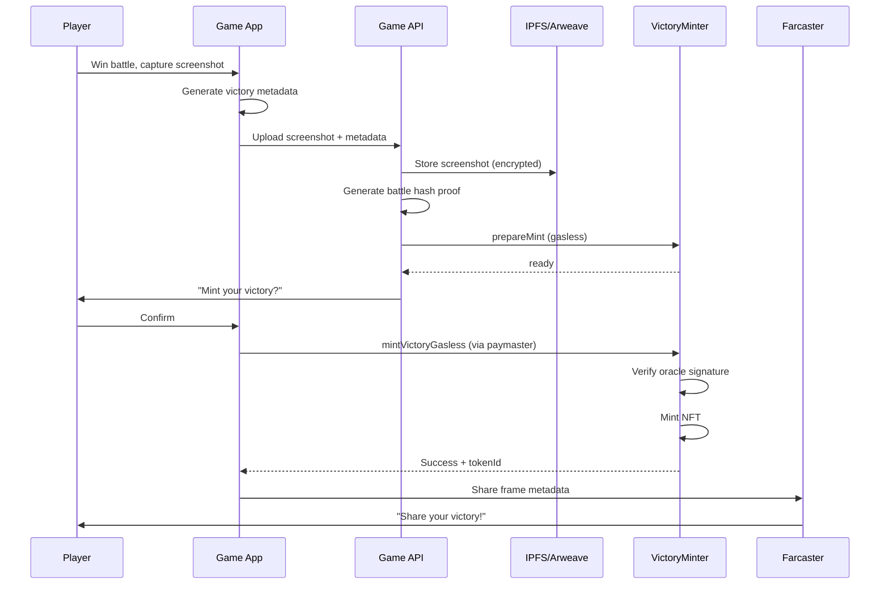
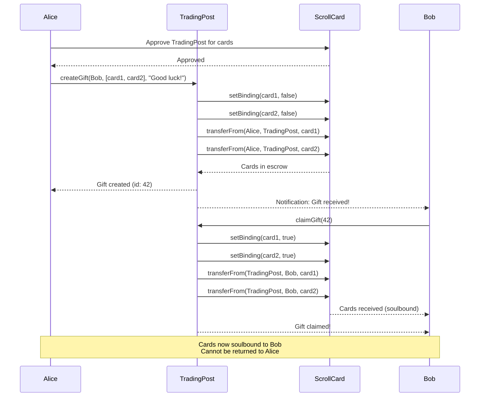
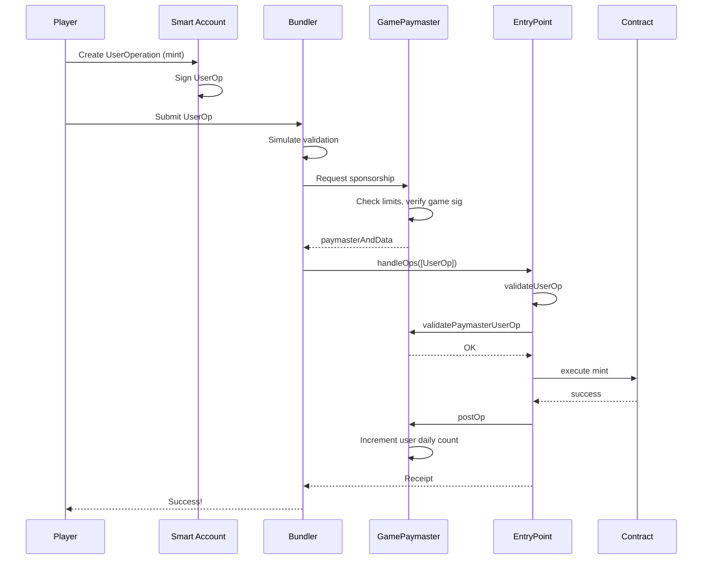

# The Inversion Excursion - Smart Contract Architecture
## Onchain Lead Design Document

**Network:** Base (Coinbase L2)  
**Primary SDK:** Zora Coins SDK  
**Account Abstraction:** ERC-4337 with Paymaster for gasless transactions  
**Metadata Standard:** Farcaster Frame v2 + OpenSea  
**Reference:** "Bullet Gifts" mechanic (one-way, no take-backs)

---

## Table of Contents

1. [Contract Overview](#contract-overview)
2. [ScrollCard NFT Contract](#1-scrollcard-nft-contract)
3. [VictoryMinter Contract](#2-victoryminter-contract)
4. [CellRegistry Contract](#3-cellregistry-contract)
5. [TradingPost Contract](#4-tradingpost-contract)
6. [Paymaster Contract](#5-paymaster-contract)
7. [Minting Flows](#minting-flows)
8. [Trading Mechanics](#trading-mechanics)
9. [Security Considerations](#security-considerations)
10. [Integration Patterns](#integration-patterns)

---

## Contract Overview



### Contract Addresses (Deployment Plan)

| Contract | Type | Purpose |
|----------|------|---------|
| `ScrollCard` | ERC-721 | Core game cards with dungeon attributes |
| `VictoryMinter` | ERC-721 | Achievement/Screenshot NFTs |
| `CellRegistry` | Custom | Cell formation & battle history |
| `TradingPost` | Custom | One-way gift mechanics |
| `GamePaymaster` | ERC-4337 | Gasless transaction sponsorship |
| `EntryPoint` | Singleton | ERC-4337 entry point (0x5FF137D4b0FDCD49DcA30c7CF57E578a026d2789) |

---

## 1. ScrollCard NFT Contract

### Purpose
Core game asset representing dungeon scrolls that players collect, trade, and use in Cell formations.

### Design Philosophy
- **Non-transferable by default** (soulbound-like) except through TradingPost
- **Rich on-chain metadata** for game mechanics
- **Dungeon-specific attributes** determine rarity and power
- **Curse mechanic** adds strategic depth

### Interface Definition

```solidity
// SPDX-License-Identifier: MIT
pragma solidity ^0.8.20;

import "@openzeppelin/contracts/token/ERC721/ERC721.sol";
import "@openzeppelin/contracts/token/ERC721/extensions/ERC721Enumerable.sol";
import "@openzeppelin/contracts/access/AccessControl.sol";
import "@openzeppelin/contracts/security/ReentrancyGuard.sol";
import "@openzeppelin/contracts/utils/Strings.sol";

/**
 * @title ScrollCard
 * @notice Core NFT contract for The Inversion Excursion
 * @dev Integrates with Zora Coins SDK for minting economics
 */
contract ScrollCard is ERC721, ERC721Enumerable, AccessControl, ReentrancyGuard {
    
    using Strings for uint256;
    
    // ============ Roles ============
    bytes32 public constant GAME_MASTER = keccak256("GAME_MASTER");
    bytes32 public constant DUNGEON_ORACLE = keccak256("DUNGEON_ORACLE");
    bytes32 public constant MINTER_ROLE = keccak256("MINTER_ROLE");
    bytes32 public constant TRADING_POST = keccak256("TRADING_POST");
    
    // ============ Enums ============
    enum Dungeon {
        THE_SPIRE,           // 0 - Vertical dungeon, gravity mechanics
        THE_MAZE,            // 1 - Procedural labyrinth
        THE_ABYSS,           // 2 - Deep descent, sanity mechanics
        THE_MIRROR,          // 3 - Reflection puzzles
        THE_FORGE,           // 4 - Crafting and transformation
        THE_VOID             // 5 - Null space, highest tier
    }
    
    enum Tier {
        ASH,                 // 0 - Common, burned easily
        IRON,                // 1 - Uncommon
        SILVER,              // 2 - Rare
        GOLD,                // 3 - Epic
        PRISM                // 4 - Legendary
    }
    
    enum Frequency {
        STATIC,              // 0 - Single use, powerful
        PULSING,             // 1 - Recharges slowly
        RESONANT,            // 2 - Synergizes with other cards
        INFINITE             // 3 - Unlimited use, weak effect
    }
    
    // ============ Structs ============
    
    /**
     * @notice Core card attributes
     * @dev Stored on-chain for game logic; metadata URI for display
     */
    struct CardAttributes {
        Dungeon dungeon;         // Which dungeon this scroll belongs to
        Tier tier;               // Rarity tier
        Frequency frequency;     // Usage pattern
        uint8 power;             // 0-100 base power
        uint8 curse;             // 0-100 curse level (negative effects)
        uint16 durability;       // Uses remaining (0 = infinite)
        uint256 mintedAt;        // Block timestamp
        uint256 dungeonSeed;     // Procedural generation seed
        address originalOwner;   // First owner (for provenance)
        bool isBound;            // Soulbound status
    }
    
    /**
     * @notice Farcaster Frame metadata
     * @dev Used for social sharing and frame integration
     */
    struct FrameMetadata {
        string frameUrl;         // Farcaster frame URL
        string splashImage;      // 1200x630 splash image
        string buttonText;       // Primary action text
        string attribution;      // Creator/Dungeon attribution
    }
    
    // ============ State ============
    
    // Token ID => Attributes
    mapping(uint256 => CardAttributes) public cardAttributes;
    
    // Token ID => Frame Metadata
    mapping(uint256 => FrameMetadata) public frameMetadata;
    
    // Dungeon => Tier => Supply tracking
    mapping(Dungeon => mapping(Tier => uint256)) public dungeonTierSupply;
    mapping(Dungeon => mapping(Tier => uint256)) public dungeonTierMaxSupply;
    
    // Base URI for metadata
    string private _baseTokenURI;
    
    // Contract URI for OpenSea
    string public contractURI;
    
    // Counter for token IDs
    uint256 private _nextTokenId;
    
    // ============ Events ============
    
    event CardMinted(
        uint256 indexed tokenId,
        address indexed to,
        Dungeon dungeon,
        Tier tier,
        uint256 dungeonSeed
    );
    
    event CardBound(uint256 indexed tokenId, bool bound);
    
    event CardUsed(uint256 indexed tokenId, uint16 remainingDurability);
    
    event DungeonSupplySet(Dungeon dungeon, Tier tier, uint256 maxSupply);
    
    event FrameMetadataSet(uint256 indexed tokenId, string frameUrl);
    
    // ============ Constructor ============
    
    constructor(
        string memory name,
        string memory symbol,
        string memory baseURI,
        string memory _contractURI
    ) ERC721(name, symbol) {
        _baseTokenURI = baseURI;
        contractURI = _contractURI;
        _nextTokenId = 1;
        
        _grantRole(DEFAULT_ADMIN_ROLE, msg.sender);
        _grantRole(GAME_MASTER, msg.sender);
        _grantRole(DUNGEON_ORACLE, msg.sender);
    }
    
    // ============ Minting Functions ============
    
    /**
     * @notice Mint a new ScrollCard
     * @param to Recipient address
     * @param dungeon Which dungeon this card belongs to
     * @param tier Rarity tier
     * @param frequency Usage frequency pattern
     * @param power Base power (0-100)
     * @param curse Curse level (0-100)
     * @param durability Initial durability
     * @param dungeonSeed Procedural generation seed
     * @param frameUrl Farcaster frame URL
     * @return tokenId The ID of the newly minted card
     */
    function mintCard(
        address to,
        Dungeon dungeon,
        Tier tier,
        Frequency frequency,
        uint8 power,
        uint8 curse,
        uint16 durability,
        uint256 dungeonSeed,
        string calldata frameUrl
    ) external onlyRole(MINTER_ROLE) nonReentrant returns (uint256) {
        
        // Supply check
        require(
            dungeonTierSupply[dungeon][tier] < dungeonTierMaxSupply[dungeon][tier],
            "ScrollCard: Tier supply exhausted"
        );
        
        uint256 tokenId = _nextTokenId++;
        
        // Create card attributes
        cardAttributes[tokenId] = CardAttributes({
            dungeon: dungeon,
            tier: tier,
            frequency: frequency,
            power: power,
            curse: curse,
            durability: durability,
            mintedAt: block.timestamp,
            dungeonSeed: dungeonSeed,
            originalOwner: to,
            isBound: true  // Soulbound by default
        });
        
        // Set frame metadata
        frameMetadata[tokenId] = FrameMetadata({
            frameUrl: frameUrl,
            splashImage: "",  // Populated off-chain
            buttonText: "Enter Dungeon",
            attribution: string.concat("Dungeon: ", _dungeonToString(dungeon))
        });
        
        // Update supply
        dungeonTierSupply[dungeon][tier]++;
        
        // Mint
        _safeMint(to, tokenId);
        
        emit CardMinted(tokenId, to, dungeon, tier, dungeonSeed);
        
        return tokenId;
    }
    
    /**
     * @notice Batch mint cards for airdrops/rewards
     * @dev Gas-optimized for multiple mints
     */
    function batchMintCards(
        address[] calldata recipients,
        Dungeon[] calldata dungeons,
        Tier[] calldata tiers,
        uint256[] calldata dungeonSeeds
    ) external onlyRole(MINTER_ROLE) nonReentrant {
        require(
            recipients.length == dungeons.length && 
            dungeons.length == tiers.length &&
            tiers.length == dungeonSeeds.length,
            "ScrollCard: Array length mismatch"
        );
        
        for (uint256 i = 0; i < recipients.length; i++) {
            // Use deterministic attributes based on seed
            (uint8 power, uint8 curse, uint16 durability) = _generateAttributes(
                dungeons[i],
                tiers[i],
                dungeonSeeds[i]
            );
            
            uint256 tokenId = _nextTokenId++;
            
            cardAttributes[tokenId] = CardAttributes({
                dungeon: dungeons[i],
                tier: tiers[i],
                frequency: Frequency.PULSING,
                power: power,
                curse: curse,
                durability: durability,
                mintedAt: block.timestamp,
                dungeonSeed: dungeonSeeds[i],
                originalOwner: recipients[i],
                isBound: true
            });
            
            dungeonTierSupply[dungeons[i]][tiers[i]]++;
            _safeMint(recipients[i], tokenId);
            
            emit CardMinted(tokenId, recipients[i], dungeons[i], tiers[i], dungeonSeeds[i]);
        }
    }
    
    // ============ Game Mechanics ============
    
    /**
     * @notice Consume card durability (called during gameplay)
     * @param tokenId Card to use
     * @param amount Durability to consume
     */
    function useCard(uint256 tokenId, uint16 amount) 
        external 
        onlyRole(GAME_MASTER) 
    {
        CardAttributes storage card = cardAttributes[tokenId];
        
        require(card.durability > 0, "ScrollCard: Infinite durability");
        require(card.durability >= amount, "ScrollCard: Insufficient durability");
        
        card.durability -= amount;
        
        emit CardUsed(tokenId, card.durability);
        
        // Burn if durability exhausted
        if (card.durability == 0) {
            _burn(tokenId);
        }
    }
    
    /**
     * @notice Toggle soulbound status (only through TradingPost)
     * @param tokenId Card to modify
     * @param bound New binding status
     */
    function setBinding(uint256 tokenId, bool bound) 
        external 
        onlyRole(TRADING_POST) 
    {
        require(_exists(tokenId), "ScrollCard: Token does not exist");
        cardAttributes[tokenId].isBound = bound;
        emit CardBound(tokenId, bound);
    }
    
    // ============ Override Transfer Functions ============
    
    /**
     * @notice Override to enforce soulbound logic
     * @dev Only TradingPost can transfer bound cards
     */
    function _beforeTokenTransfer(
        address from,
        address to,
        uint256 tokenId,
        uint256 batchSize
    ) internal virtual override(ERC721, ERC721Enumerable) {
        super._beforeTokenTransfer(from, to, tokenId, batchSize);
        
        // Allow minting (from == address(0)) and burning (to == address(0))
        if (from != address(0) && to != address(0)) {
            CardAttributes memory card = cardAttributes[tokenId];
            
            // If bound, only TradingPost can transfer (for gifting)
            if (card.isBound) {
                require(
                    hasRole(TRADING_POST, msg.sender),
                    "ScrollCard: Card is soulbound, use TradingPost"
                );
            }
        }
    }
    
    // ============ View Functions ============
    
    /**
     * @notice Get complete card data
     */
    function getCard(uint256 tokenId) 
        external 
        view 
        returns (CardAttributes memory, FrameMetadata memory) 
    {
        require(_exists(tokenId), "ScrollCard: Token does not exist");
        return (cardAttributes[tokenId], frameMetadata[tokenId]);
    }
    
    /**
     * @notice Get cards owned by address
     */
    function getCardsByOwner(address owner) 
        external 
        view 
        returns (uint256[] memory) 
    {
        uint256 balance = balanceOf(owner);
        uint256[] memory tokens = new uint256[](balance);
        
        for (uint256 i = 0; i < balance; i++) {
            tokens[i] = tokenOfOwnerByIndex(owner, i);
        }
        
        return tokens;
    }
    
    /**
     * @notice Get cards by dungeon
     */
    function getCardsByDungeon(address owner, Dungeon dungeon) 
        external 
        view 
        returns (uint256[] memory) 
    {
        uint256 balance = balanceOf(owner);
        uint256 count = 0;
        
        // First pass: count matching cards
        for (uint256 i = 0; i < balance; i++) {
            uint256 tokenId = tokenOfOwnerByIndex(owner, i);
            if (cardAttributes[tokenId].dungeon == dungeon) {
                count++;
            }
        }
        
        // Second pass: populate array
        uint256[] memory tokens = new uint256[](count);
        uint256 index = 0;
        for (uint256 i = 0; i < balance; i++) {
            uint256 tokenId = tokenOfOwnerByIndex(owner, i);
            if (cardAttributes[tokenId].dungeon == dungeon) {
                tokens[index++] = tokenId;
            }
        }
        
        return tokens;
    }
    
    /**
     * @notice Calculate effective power (considering curse)
     */
    function getEffectivePower(uint256 tokenId) external view returns (uint8) {
        CardAttributes memory card = cardAttributes[tokenId];
        
        // Curse reduces effective power
        if (card.curse >= card.power) {
            return 0;
        }
        
        return card.power - card.curse;
    }
    
    // ============ Admin Functions ============
    
    function setMaxSupply(
        Dungeon dungeon,
        Tier tier,
        uint256 maxSupply
    ) external onlyRole(GAME_MASTER) {
        dungeonTierMaxSupply[dungeon][tier] = maxSupply;
        emit DungeonSupplySet(dungeon, tier, maxSupply);
    }
    
    function setBaseURI(string memory newBaseURI) external onlyRole(DEFAULT_ADMIN_ROLE) {
        _baseTokenURI = newBaseURI;
    }
    
    function setContractURI(string memory newContractURI) external onlyRole(DEFAULT_ADMIN_ROLE) {
        contractURI = newContractURI;
    }
    
    function setFrameMetadata(
        uint256 tokenId,
        string calldata frameUrl,
        string calldata splashImage,
        string calldata buttonText
    ) external onlyRole(GAME_MASTER) {
        require(_exists(tokenId), "ScrollCard: Token does not exist");
        
        FrameMetadata storage frame = frameMetadata[tokenId];
        frame.frameUrl = frameUrl;
        frame.splashImage = splashImage;
        frame.buttonText = buttonText;
        
        emit FrameMetadataSet(tokenId, frameUrl);
    }
    
    // ============ Internal Functions ============
    
    function _generateAttributes(
        Dungeon dungeon,
        Tier tier,
        uint256 seed
    ) internal pure returns (uint8 power, uint8 curse, uint16 durability) {
        // Deterministic attribute generation from seed
        uint256 rand = uint256(keccak256(abi.encodePacked(dungeon, tier, seed)));
        
        // Base power by tier (20-30 range per tier)
        uint8 basePower = uint8(20 + uint8(tier) * 20);
        power = basePower + uint8(rand % 20);  // +0-19 variance
        
        // Curse 0-40 based on tier (higher tier = more curse potential)
        curse = uint8((rand >> 8) % (10 + uint8(tier) * 10));
        
        // Durability by frequency (simulated)
        uint256 freqRoll = (rand >> 16) % 100;
        if (freqRoll < 10) {
            durability = 1;      // STATIC - single use
        } else if (freqRoll < 40) {
            durability = uint16(3 + (rand >> 24) % 5);  // PULSING - 3-7 uses
        } else if (freqRoll < 70) {
            durability = uint16(5 + (rand >> 24) % 10); // RESONANT - 5-14 uses
        } else {
            durability = 0;      // INFINITE
        }
    }
    
    function _dungeonToString(Dungeon dungeon) internal pure returns (string memory) {
        string[6] memory names = [
            "The Spire",
            "The Maze", 
            "The Abyss",
            "The Mirror",
            "The Forge",
            "The Void"
        ];
        return names[uint256(dungeon)];
    }
    
    function _baseURI() internal view override returns (string memory) {
        return _baseTokenURI;
    }
    
    function tokenURI(uint256 tokenId) 
        public 
        view 
        override 
        returns (string memory) 
    {
        require(_exists(tokenId), "ScrollCard: Token does not exist");
        
        string memory baseURI = _baseURI();
        return bytes(baseURI).length > 0 
            ? string.concat(baseURI, tokenId.toString())
            : "";
    }
    
    // ============ Interface Support ============
    
    function supportsInterface(bytes4 interfaceId)
        public
        view
        override(ERC721, ERC721Enumerable, AccessControl)
        returns (bool)
    {
        return super.supportsInterface(interfaceId);
    }
}
```

---

## 2. VictoryMinter Contract

### Purpose
Mints victory screenshots and battle achievements as commemorative NFTs. Integrates with Farcaster Frames for social sharing.

### Design Philosophy
- **Screenshot-as-NFT** - Turn victory moments into collectibles
- **Farcaster-first** - Optimized for social discovery and sharing
- **Zora Coins integration** - Optional monetization of achievements
- **Immutable proof** - Cryptographic verification of battle outcomes

### Interface Definition

```solidity
// SPDX-License-Identifier: MIT
pragma solidity ^0.8.20;

import "@openzeppelin/contracts/token/ERC721/ERC721.sol";
import "@openzeppelin/contracts/access/AccessControl.sol";
import "@openzeppelin/contracts/utils/cryptography/ECDSA.sol";
import "@openzeppelin/contracts/utils/cryptography/MessageHashUtils.sol";

/**
 * @title VictoryMinter
 * @notice Mints victory screenshots and achievements as NFTs
 * @dev Integrates with Zora Coins for optional paid minting
 */
contract VictoryMinter is ERC721, AccessControl {
    
    using ECDSA for bytes32;
    using MessageHashUtils for bytes32;
    
    // ============ Roles ============
    bytes32 public constant ORACLE_ROLE = keccak256("ORACLE_ROLE");
    bytes32 public constant VERIFIER_ROLE = keccak256("VERIFIER_ROLE");
    
    // ============ Structs ============
    
    struct VictoryData {
        uint256 battleId;           // Reference to CellRegistry battle
        address[] participants;     // Cell members
        uint256 victoryScore;       // Calculated victory metric
        string screenshotCID;       // IPFS CID of screenshot
        string metadataCID;         // IPFS CID of full metadata
        uint256 achievedAt;         // Timestamp
        bytes32 battleHash;         // Cryptographic battle proof
        bool isSharedVictory;       // Multi-player victory
    }
    
    struct FarcasterFrame {
        string frameUrl;            // Frame endpoint
        string imageUrl;            // 1200x630 splash
        string title;               // Victory title
        string description;         // Frame description
        string buttonText;          // CTA button
        string splashImageUrl;      // Animated splash if available
    }
    
    // ============ State ============
    
    mapping(uint256 => VictoryData) public victories;
    mapping(uint256 => FarcasterFrame) public frameData;
    
    // Battle ID => Victory Token ID (one victory per battle)
    mapping(uint256 => uint256) public battleToVictory;
    
    // Nonce tracking for replay protection
    mapping(bytes32 => bool) public usedHashes;
    
    // Minting fees (0 = free)
    uint256 public mintFee;
    address public feeRecipient;
    
    // Zora Coins integration
    address public zoraCoinsRecipient;
    
    uint256 private _nextTokenId;
    string private _baseTokenURI;
    
    // ============ Events ============
    
    event VictoryMinted(
        uint256 indexed tokenId,
        uint256 indexed battleId,
        address indexed recipient,
        string screenshotCID
    );
    
    event SharedVictory(
        uint256 indexed tokenId,
        uint256 indexed battleId,
        address[] recipients
    );
    
    event ScreenshotVerified(
        uint256 indexed battleId,
        bytes32 indexed screenshotHash,
        address verifier
    );
    
    // ============ Constructor ============
    
    constructor(
        string memory name,
        string memory symbol,
        string memory baseURI
    ) ERC721(name, symbol) {
        _baseTokenURI = baseURI;
        _nextTokenId = 1;
        feeRecipient = msg.sender;
        
        _grantRole(DEFAULT_ADMIN_ROLE, msg.sender);
        _grantRole(ORACLE_ROLE, msg.sender);
        _grantRole(VERIFIER_ROLE, msg.sender);
    }
    
    // ============ Minting Functions ============
    
    /**
     * @notice Mint a victory NFT from verified battle data
     * @param to Recipient address
     * @param battleId Reference battle ID from CellRegistry
     * @param participants Cell members who earned this victory
     * @param victoryScore Calculated score (0-10000)
     * @param screenshotCID IPFS CID of victory screenshot
     * @param metadataCID IPFS CID of full metadata JSON
     * @param battleHash Cryptographic proof of battle
     * @param signature Oracle signature verifying the victory
     * @return tokenId The minted victory NFT ID
     */
    function mintVictory(
        address to,
        uint256 battleId,
        address[] calldata participants,
        uint256 victoryScore,
        string calldata screenshotCID,
        string calldata metadataCID,
        bytes32 battleHash,
        bytes calldata signature
    ) external payable returns (uint256) {
        
        require(battleToVictory[battleId] == 0, "VictoryMinter: Battle already has victory");
        require(msg.value >= mintFee, "VictoryMinter: Insufficient mint fee");
        require(participants.length > 0, "VictoryMinter: No participants");
        
        // Verify oracle signature
        bytes32 messageHash = keccak256(abi.encodePacked(
            battleId,
            participants,
            victoryScore,
            screenshotCID,
            battleHash,
            block.chainid
        ));
        
        address signer = messageHash.toEthSignedMessageHash().recover(signature);
        require(hasRole(ORACLE_ROLE, signer), "VictoryMinter: Invalid signature");
        
        require(!usedHashes[messageHash], "VictoryMinter: Victory already minted");
        usedHashes[messageHash] = true;
        
        uint256 tokenId = _nextTokenId++;
        
        victories[tokenId] = VictoryData({
            battleId: battleId,
            participants: participants,
            victoryScore: victoryScore,
            screenshotCID: screenshotCID,
            metadataCID: metadataCID,
            achievedAt: block.timestamp,
            battleHash: battleHash,
            isSharedVictory: participants.length > 1
        });
        
        battleToVictory[battleId] = tokenId;
        
        // Generate Farcaster frame data
        frameData[tokenId] = FarcasterFrame({
            frameUrl: string.concat("https://inversion.excursion/victory/", _toString(tokenId)),
            imageUrl: string.concat("ipfs://", screenshotCID),
            title: _generateVictoryTitle(victoryScore),
            description: _generateDescription(participants, victoryScore),
            buttonText: "Claim Victory",
            splashImageUrl: string.concat("ipfs://", screenshotCID)
        });
        
        // Mint to all participants for shared victories
        if (participants.length > 1) {
            for (uint256 i = 0; i < participants.length; i++) {
                _safeMint(participants[i], tokenId);
            }
            emit SharedVictory(tokenId, battleId, participants);
        } else {
            _safeMint(to, tokenId);
        }
        
        // Handle fees
        if (msg.value > 0) {
            (bool sent, ) = feeRecipient.call{value: msg.value}("");
            require(sent, "VictoryMinter: Fee transfer failed");
        }
        
        emit VictoryMinted(tokenId, battleId, to, screenshotCID);
        
        return tokenId;
    }
    
    /**
     * @notice Gasless mint via ERC-4337 paymaster
     * @dev Called by paymaster with pre-validated signature
     */
    function mintVictoryGasless(
        address to,
        uint256 battleId,
        address[] calldata participants,
        uint256 victoryScore,
        string calldata screenshotCID,
        string calldata metadataCID,
        bytes32 battleHash,
        uint256 validUntil,
        bytes calldata signature
    ) external onlyRole(VERIFIER_ROLE) returns (uint256) {
        
        require(block.timestamp < validUntil, "VictoryMinter: Signature expired");
        require(battleToVictory[battleId] == 0, "VictoryMinter: Battle already has victory");
        
        // Simplified verification for gasless path
        bytes32 messageHash = keccak256(abi.encodePacked(
            to, battleId, screenshotCID, validUntil, block.chainid
        ));
        
        address signer = messageHash.toEthSignedMessageHash().recover(signature);
        require(hasRole(ORACLE_ROLE, signer), "VictoryMinter: Invalid oracle");
        
        uint256 tokenId = _nextTokenId++;
        
        victories[tokenId] = VictoryData({
            battleId: battleId,
            participants: participants,
            victoryScore: victoryScore,
            screenshotCID: screenshotCID,
            metadataCID: metadataCID,
            achievedAt: block.timestamp,
            battleHash: battleHash,
            isSharedVictory: participants.length > 1
        });
        
        battleToVictory[battleId] = tokenId;
        _safeMint(to, tokenId);
        
        emit VictoryMinted(tokenId, battleId, to, screenshotCID);
        
        return tokenId;
    }
    
    // ============ Farcaster Frame Integration ============
    
    /**
     * @notice Get frame metadata for Farcaster
     * @dev Returns JSON for fc:frame meta tags
     */
    function getFrameMetadata(uint256 tokenId) 
        external 
        view 
        returns (string memory) 
    {
        require(_exists(tokenId), "VictoryMinter: Token does not exist");
        
        FarcasterFrame memory frame = frameData[tokenId];
        VictoryData memory victory = victories[tokenId];
        
        // Return JSON string for frame embedding
        return string(abi.encodePacked(
            '{"fc:frame":"vNext",',
            '"fc:frame:image":"', frame.imageUrl, '",',
            '"fc:frame:button:1":"', frame.buttonText, '",',
            '"fc:frame:post_url":"', frame.frameUrl, '",',
            '"og:title":"', frame.title, '",',
            '"og:description":"', frame.description, '",',
            '"battle_id":"', _toString(victory.battleId), '",',
            '"score":"', _toString(victory.victoryScore), '"}'
        ));
    }
    
    /**
     * @notice Validate frame action (called by Farcaster)
     * @dev Verifies user can interact with this victory frame
     */
    function validateFrameAction(
        uint256 tokenId,
        address user,
        bytes calldata signature
    ) external view returns (bool) {
        require(_exists(tokenId), "VictoryMinter: Token does not exist");
        
        VictoryData memory victory = victories[tokenId];
        
        // Check if user is a participant
        for (uint256 i = 0; i < victory.participants.length; i++) {
            if (victory.participants[i] == user) {
                // Verify signature
                bytes32 messageHash = keccak256(abi.encodePacked(user, tokenId, block.chainid));
                address signer = messageHash.toEthSignedMessageHash().recover(signature);
                return hasRole(VERIFIER_ROLE, signer);
            }
        }
        
        return false;
    }
    
    // ============ Admin Functions ============
    
    function setMintFee(uint256 newFee) external onlyRole(DEFAULT_ADMIN_ROLE) {
        mintFee = newFee;
    }
    
    function setFeeRecipient(address newRecipient) external onlyRole(DEFAULT_ADMIN_ROLE) {
        feeRecipient = newRecipient;
    }
    
    function setZoraRecipient(address recipient) external onlyRole(DEFAULT_ADMIN_ROLE) {
        zoraCoinsRecipient = recipient;
    }
    
    function setFrameData(
        uint256 tokenId,
        string calldata frameUrl,
        string calldata imageUrl,
        string calldata title,
        string calldata description
    ) external onlyRole(ORACLE_ROLE) {
        require(_exists(tokenId), "VictoryMinter: Token does not exist");
        
        FarcasterFrame storage frame = frameData[tokenId];
        frame.frameUrl = frameUrl;
        frame.imageUrl = imageUrl;
        frame.title = title;
        frame.description = description;
    }
    
    // ============ View Functions ============
    
    function getVictory(uint256 tokenId) 
        external 
        view 
        returns (VictoryData memory, FarcasterFrame memory) 
    {
        require(_exists(tokenId), "VictoryMinter: Token does not exist");
        return (victories[tokenId], frameData[tokenId]);
    }
    
    function getVictoriesByBattle(uint256 battleId) 
        external 
        view 
        returns (uint256) 
    {
        return battleToVictory[battleId];
    }
    
    function getParticipantVictories(address participant) 
        external 
        view 
        returns (uint256[] memory) 
    {
        uint256 balance = balanceOf(participant);
        uint256[] memory tokens = new uint256[](balance);
        
        for (uint256 i = 0; i < balance; i++) {
            tokens[i] = tokenOfOwnerByIndex(participant, i);
        }
        
        return tokens;
    }
    
    // ============ Internal Functions ============
    
    function _generateVictoryTitle(uint256 score) internal pure returns (string memory) {
        if (score >= 9500) return "LEGENDARY VICTORY";
        if (score >= 8000) return "Epic Triumph";
        if (score >= 6000) return "Glorious Win";
        if (score >= 4000) return "Solid Victory";
        return "Hard-Fought Battle";
    }
    
    function _generateDescription(
        address[] memory participants,
        uint256 score
    ) internal pure returns (string memory) {
        if (participants.length > 1) {
            return string.concat(
                "A shared victory achieved by ",
                _toString(participants.length),
                " Cell members. Score: ",
                _toString(score / 100),
                "/100"
            );
        }
        return string.concat(
            "Solo victory with score: ",
            _toString(score / 100),
            "/100"
        );
    }
    
    function _toString(uint256 value) internal pure returns (string memory) {
        if (value == 0) return "0";
        uint256 temp = value;
        uint256 digits;
        while (temp != 0) {
            digits++;
            temp /= 10;
        }
        bytes memory buffer = new bytes(digits);
        while (value != 0) {
            digits--;
            buffer[digits] = bytes1(uint8(48 + uint256(value % 10)));
            value /= 10;
        }
        return string(buffer);
    }
    
    function tokenURI(uint256 tokenId) public view override returns (string memory) {
        require(_exists(tokenId), "VictoryMinter: Token does not exist");
        
        VictoryData memory victory = victories[tokenId];
        return string.concat("ipfs://", victory.metadataCID);
    }
    
    function supportsInterface(bytes4 interfaceId)
        public
        view
        override(ERC721, AccessControl)
        returns (bool)
    {
        return super.supportsInterface(interfaceId);
    }
}
```

---

## 3. CellRegistry Contract

### Purpose
Tracks Cell formations, battle history, shared victories, and on-chain Cell reputation.

### Design Philosophy
- **Cell as primitive** - First-class on-chain entity
- **Formation tracking** - Who joined, who left, when
- **Battle provenance** - Immutable record of encounters
- **Reputation accumulation** - Soulbound Cell stats

### Interface Definition

```solidity
// SPDX-License-Identifier: MIT
pragma solidity ^0.8.20;

import "@openzeppelin/contracts/access/AccessControl.sol";
import "@openzeppelin/contracts/security/ReentrancyGuard.sol";
import "@openzeppelin/contracts/utils/structs/EnumerableSet.sol";

/**
 * @title CellRegistry
 * @notice Tracks Cell formations, battles, and shared victories
 * @dev Central registry for all Cell activity
 */
contract CellRegistry is AccessControl, ReentrancyGuard {
    
    using EnumerableSet for EnumerableSet.AddressSet;
    
    // ============ Roles ============
    bytes32 public constant GAME_MASTER = keccak256("GAME_MASTER");
    bytes32 public constant BATTLE_ORACLE = keccak256("BATTLE_ORACLE");
    
    // ============ Structs ============
    
    /**
     * @notice A Cell - group of players
     * @dev Cells are semi-permanent formations
     */
    struct Cell {
        uint256 cellId;
        string name;
        string crestCID;            // IPFS CID of Cell crest/logo
        address leader;
        uint256 formedAt;
        uint256 disbandedAt;        // 0 if active
        bool isActive;
        uint256 totalBattles;
        uint256 totalVictories;
        uint256 reputation;         // Accumulated reputation score
        string faction;             // Optional faction alignment
    }
    
    /**
     * @notice Battle record
     * @dev Immutable record of dungeon encounters
     */
    struct Battle {
        uint256 battleId;
        uint256 cellId;
        uint256 dungeonId;          // Which dungeon
        uint256 startedAt;
        uint256 endedAt;
        uint256 victoryScore;       // 0-10000
        bool isVictory;
        bytes32 battleHash;         // Cryptographic proof
        uint256[] cardIds;          // Cards used
        address[] participants;     // Who fought
        string outcomeCID;          // IPFS record of full outcome
    }
    
    /**
     * @notice Membership record
     * @dev Tracks join/leave history
     */
    struct Membership {
        uint256 joinedAt;
        uint256 leftAt;             // 0 if current member
        uint256 battlesParticipated;
        uint256 victoriesParticipated;
        bool isCurrent;
    }
    
    /**
     * @notice Cell formation event
     * @dev For on-chain Cell timeline
     */
    struct FormationEvent {
        uint256 timestamp;
        address member;
        bool isJoin;                // true = join, false = leave
        uint256 battleCountAtEvent;
    }
    
    // ============ State ============
    
    // Cell ID => Cell data
    mapping(uint256 => Cell) public cells;
    
    // Battle ID => Battle data
    mapping(uint256 => Battle) public battles;
    
    // Cell ID => Member => Membership
    mapping(uint256 => mapping(address => Membership)) public memberships;
    
    // Cell ID => Current members (set for efficient iteration)
    mapping(uint256 => EnumerableSet.AddressSet) private cellMembers;
    
    // Player => Cells they're in
    mapping(address => uint256[]) public playerCells;
    
    // Cell ID => Formation history
    mapping(uint256 => FormationEvent[]) public formationHistory;
    
    // Dungeon ID => Battle count
    mapping(uint256 => uint256) public dungeonBattleCount;
    
    // Counters
    uint256 public nextCellId;
    uint256 public nextBattleId;
    
    // Maximum Cell size
    uint256 public constant MAX_CELL_SIZE = 6;
    
    // Minimum formation time before disband (prevents flash cells)
    uint256 public constant MIN_CELL_LIFETIME = 1 hours;
    
    // ============ Events ============
    
    event CellFormed(
        uint256 indexed cellId,
        address indexed leader,
        string name,
        uint256 formedAt
    );
    
    event MemberJoined(
        uint256 indexed cellId,
        address indexed member,
        uint256 timestamp
    );
    
    event MemberLeft(
        uint256 indexed cellId,
        address indexed member,
        uint256 timestamp
    );
    
    event CellDisbanded(
        uint256 indexed cellId,
        uint256 timestamp
    );
    
    event BattleRecorded(
        uint256 indexed battleId,
        uint256 indexed cellId,
        uint256 dungeonId,
        bool isVictory,
        uint256 victoryScore
    );
    
    event ReputationAwarded(
        uint256 indexed cellId,
        uint256 amount,
        string reason
    );
    
    // ============ Constructor ============
    
    constructor() {
        _grantRole(DEFAULT_ADMIN_ROLE, msg.sender);
        _grantRole(GAME_MASTER, msg.sender);
        _grantRole(BATTLE_ORACLE, msg.sender);
        
        nextCellId = 1;
        nextBattleId = 1;
    }
    
    // ============ Cell Management ============
    
    /**
     * @notice Form a new Cell
     * @param name Cell name
     * @param crestCID IPFS CID of Cell crest
     * @param faction Optional faction alignment
     * @return cellId The new Cell's ID
     */
    function formCell(
        string calldata name,
        string calldata crestCID,
        string calldata faction
    ) external nonReentrant returns (uint256) {
        
        uint256 cellId = nextCellId++;
        
        cells[cellId] = Cell({
            cellId: cellId,
            name: name,
            crestCID: crestCID,
            leader: msg.sender,
            formedAt: block.timestamp,
            disbandedAt: 0,
            isActive: true,
            totalBattles: 0,
            totalVictories: 0,
            reputation: 0,
            faction: faction
        });
        
        // Leader is first member
        _addMember(cellId, msg.sender);
        
        emit CellFormed(cellId, msg.sender, name, block.timestamp);
        
        return cellId;
    }
    
    /**
     * @notice Join an existing Cell
     * @param cellId Cell to join
     */
    function joinCell(uint256 cellId) external nonReentrant {
        Cell storage cell = cells[cellId];
        
        require(cell.isActive, "CellRegistry: Cell not active");
        require(cellMembers[cellId].length() < MAX_CELL_SIZE, "CellRegistry: Cell is full");
        require(!cellMembers[cellId].contains(msg.sender), "CellRegistry: Already a member");
        
        _addMember(cellId, msg.sender);
        
        emit MemberJoined(cellId, msg.sender, block.timestamp);
    }
    
    /**
     * @notice Leave current Cell
     * @param cellId Cell to leave
     */
    function leaveCell(uint256 cellId) external nonReentrant {
        require(cellMembers[cellId].contains(msg.sender), "CellRegistry: Not a member");
        
        Cell storage cell = cells[cellId];
        
        // Leader cannot leave without transferring leadership or disbanding
        if (cell.leader == msg.sender) {
            require(
                cellMembers[cellId].length() == 1,
                "CellRegistry: Transfer leadership before leaving"
            );
            // Last member leaving = disband
            _disbandCell(cellId);
        } else {
            _removeMember(cellId, msg.sender);
            emit MemberLeft(cellId, msg.sender, block.timestamp);
        }
    }
    
    /**
     * @notice Disband a Cell (leader only)
     * @param cellId Cell to disband
     */
    function disbandCell(uint256 cellId) external nonReentrant {
        Cell storage cell = cells[cellId];
        
        require(cell.leader == msg.sender, "CellRegistry: Not leader");
        require(cell.isActive, "CellRegistry: Already disbanded");
        require(
            block.timestamp >= cell.formedAt + MIN_CELL_LIFETIME,
            "CellRegistry: Cell too new"
        );
        
        _disbandCell(cellId);
    }
    
    /**
     * @notice Transfer leadership
     * @param cellId Cell to transfer
     * @param newLeader New leader address
     */
    function transferLeadership(uint256 cellId, address newLeader) 
        external 
        nonReentrant 
    {
        Cell storage cell = cells[cellId];
        
        require(cell.leader == msg.sender, "CellRegistry: Not leader");
        require(cellMembers[cellId].contains(newLeader), "CellRegistry: New leader not member");
        
        cell.leader = newLeader;
    }
    
    // ============ Battle Recording ============
    
    /**
     * @notice Record a battle outcome
     * @param cellId Participating Cell
     * @param dungeonId Dungeon identifier
     * @param victoryScore 0-10000 score
     * @param isVictory Whether battle was won
     * @param battleHash Cryptographic proof
     * @param cardIds Cards used in battle
     * @param participants Who participated
     * @param outcomeCID IPFS record
     * @return battleId The recorded battle ID
     */
    function recordBattle(
        uint256 cellId,
        uint256 dungeonId,
        uint256 victoryScore,
        bool isVictory,
        bytes32 battleHash,
        uint256[] calldata cardIds,
        address[] calldata participants,
        string calldata outcomeCID
    ) external onlyRole(BATTLE_ORACLE) returns (uint256) {
        
        Cell storage cell = cells[cellId];
        require(cell.isActive, "CellRegistry: Cell not active");
        
        uint256 battleId = nextBattleId++;
        
        battles[battleId] = Battle({
            battleId: battleId,
            cellId: cellId,
            dungeonId: dungeonId,
            startedAt: block.timestamp - 1 hours,  // Approximate, set by oracle
            endedAt: block.timestamp,
            victoryScore: victoryScore,
            isVictory: isVictory,
            battleHash: battleHash,
            cardIds: cardIds,
            participants: participants,
            outcomeCID: outcomeCID
        });
        
        // Update Cell stats
        cell.totalBattles++;
        if (isVictory) {
            cell.totalVictories++;
        }
        
        // Update member participation
        for (uint256 i = 0; i < participants.length; i++) {
            Membership storage membership = memberships[cellId][participants[i]];
            membership.battlesParticipated++;
            if (isVictory) {
                membership.victoriesParticipated++;
            }
        }
        
        // Update dungeon stats
        dungeonBattleCount[dungeonId]++;
        
        // Award reputation
        uint256 repGain = isVictory ? victoryScore / 100 : 1;
        cell.reputation += repGain;
        
        emit BattleRecorded(battleId, cellId, dungeonId, isVictory, victoryScore);
        emit ReputationAwarded(cellId, repGain, isVictory ? "Victory" : "Participation");
        
        return battleId;
    }
    
    // ============ View Functions ============
    
    function getCell(uint256 cellId) external view returns (Cell memory) {
        return cells[cellId];
    }
    
    function getBattle(uint256 battleId) external view returns (Battle memory) {
        return battles[battleId];
    }
    
    function getCellMembers(uint256 cellId) external view returns (address[] memory) {
        return cellMembers[cellId].values();
    }
    
    function getCellMemberCount(uint256 cellId) external view returns (uint256) {
        return cellMembers[cellId].length();
    }
    
    function isCellMember(uint256 cellId, address member) external view returns (bool) {
        return cellMembers[cellId].contains(member);
    }
    
    function getMembership(uint256 cellId, address member) 
        external 
        view 
        returns (Membership memory) 
    {
        return memberships[cellId][member];
    }
    
    function getPlayerCells(address player) external view returns (uint256[] memory) {
        return playerCells[player];
    }
    
    function getFormationHistory(uint256 cellId) 
        external 
        view 
        returns (FormationEvent[] memory) 
    {
        return formationHistory[cellId];
    }
    
    function getCellBattleHistory(uint256 cellId, uint256 count) 
        external 
        view 
        returns (uint256[] memory) 
    {
        uint256[] memory battleIds = new uint256[](count);
        uint256 found = 0;
        
        // Iterate backwards from latest battle
        for (uint256 i = nextBattleId - 1; i > 0 && found < count; i--) {
            if (battles[i].cellId == cellId) {
                battleIds[found++] = i;
            }
        }
        
        // Resize array
        assembly {
            mstore(battleIds, found)
        }
        
        return battleIds;
    }
    
    /**
     * @notice Get top Cells by reputation
     * @dev Simple leaderboard (not gas-efficient for large sets)
     */
    function getTopCells(uint256 count) external view returns (uint256[] memory) {
        require(count <= nextCellId - 1, "CellRegistry: Count too high");
        
        uint256[] memory topCells = new uint256[](count);
        uint256[] memory topRep = new uint256[](count);
        
        for (uint256 i = 1; i < nextCellId; i++) {
            if (!cells[i].isActive) continue;
            
            uint256 rep = cells[i].reputation;
            
            // Insert into sorted array
            for (uint256 j = 0; j < count; j++) {
                if (rep > topRep[j]) {
                    // Shift down
                    for (uint256 k = count - 1; k > j; k--) {
                        topRep[k] = topRep[k - 1];
                        topCells[k] = topCells[k - 1];
                    }
                    topRep[j] = rep;
                    topCells[j] = i;
                    break;
                }
            }
        }
        
        return topCells;
    }
    
    // ============ Internal Functions ============
    
    function _addMember(uint256 cellId, address member) internal {
        cellMembers[cellId].add(member);
        
        memberships[cellId][member] = Membership({
            joinedAt: block.timestamp,
            leftAt: 0,
            battlesParticipated: 0,
            victoriesParticipated: 0,
            isCurrent: true
        });
        
        playerCells[member].push(cellId);
        
        formationHistory[cellId].push(FormationEvent({
            timestamp: block.timestamp,
            member: member,
            isJoin: true,
            battleCountAtEvent: cells[cellId].totalBattles
        }));
    }
    
    function _removeMember(uint256 cellId, address member) internal {
        cellMembers[cellId].remove(member);
        
        Membership storage membership = memberships[cellId][member];
        membership.leftAt = block.timestamp;
        membership.isCurrent = false;
        
        formationHistory[cellId].push(FormationEvent({
            timestamp: block.timestamp,
            member: member,
            isJoin: false,
            battleCountAtEvent: cells[cellId].totalBattles
        }));
    }
    
    function _disbandCell(uint256 cellId) internal {
        Cell storage cell = cells[cellId];
        
        cell.isActive = false;
        cell.disbandedAt = block.timestamp;
        
        // Mark all members as left
        address[] memory members = cellMembers[cellId].values();
        for (uint256 i = 0; i < members.length; i++) {
            _removeMember(cellId, members[i]);
        }
        
        emit CellDisbanded(cellId, block.timestamp);
    }
}
```

---

## 4. TradingPost Contract

### Purpose
Enables card gifting - one-way, no take-backs, like "Bullet Gifts" from the book.

### Design Philosophy
- **No marketplace** - Only gifting, no selling
- **One-way transfer** - Gifts cannot be returned
- **Optional message** - Personal context with each gift
- **Batch gifting** - Send multiple cards at once

### Interface Definition

```solidity
// SPDX-License-Identifier: MIT
pragma solidity ^0.8.20;

import "@openzeppelin/contracts/access/AccessControl.sol";
import "@openzeppelin/contracts/security/ReentrancyGuard.sol";
import "@openzeppelin/contracts/security/Pausable.sol";
import "./ScrollCard.sol";

/**
 * @title TradingPost
 * @notice One-way gifting system for ScrollCards
 * @dev "Bullet Gifts" - once given, cannot be returned
 */
contract TradingPost is AccessControl, ReentrancyGuard, Pausable {
    
    // ============ Roles ============
    bytes32 public constant GAME_MASTER = keccak256("GAME_MASTER");
    
    // ============ Structs ============
    
    /**
     * @notice A gift record
     * @dev Immutable once created
     */
    struct Gift {
        uint256 giftId;
        address from;
        address to;
        uint256[] cardIds;
        string message;             // Encrypted or plaintext message
        uint256 createdAt;
        uint256 expiresAt;          // 0 = never expires
        bool isClaimed;
        bool isRefunded;            // If expired and refunded
        bytes32 giftHash;           // Unique identifier
    }
    
    /**
     * @notice Gift metadata for display
     */
    struct GiftMetadata {
        string wrappingCID;         // Visual wrapping image
        string animationCID;        // Optional animation
        string giftType;            // "Standard", "Mystery", "Legendary"
    }
    
    // ============ State ============
    
    ScrollCard public scrollCard;
    
    mapping(uint256 => Gift) public gifts;
    mapping(uint256 => GiftMetadata) public giftMetadata;
    
    // Gift hash => giftId (prevents duplicate gifts)
    mapping(bytes32 => uint256) public giftHashToId;
    
    // User => received gift IDs
    mapping(address => uint256[]) public receivedGifts;
    
    // User => sent gift IDs
    mapping(address => uint256[]) public sentGifts;
    
    // Gift expiration time (default: 7 days)
    uint256 public defaultExpiration = 7 days;
    
    // Maximum cards per gift
    uint256 public constant MAX_CARDS_PER_GIFT = 10;
    
    // Maximum message length
    uint256 public constant MAX_MESSAGE_LENGTH = 280;  // Tweet-length
    
    // Gift counter
    uint256 public nextGiftId;
    
    // ============ Events ============
    
    event GiftCreated(
        uint256 indexed giftId,
        address indexed from,
        address indexed to,
        uint256[] cardIds,
        bytes32 giftHash
    );
    
    event GiftClaimed(
        uint256 indexed giftId,
        address indexed by,
        uint256 timestamp
    );
    
    event GiftRefunded(
        uint256 indexed giftId,
        address indexed to,
        uint256 timestamp
    );
    
    event GiftExpired(
        uint256 indexed giftId,
        uint256 expiredAt
    );
    
    event CardsGifted(
        address indexed from,
        address indexed to,
        uint256[] cardIds,
        uint256 timestamp
    );
    
    // ============ Constructor ============
    
    constructor(address _scrollCard) {
        scrollCard = ScrollCard(_scrollCard);
        nextGiftId = 1;
        
        _grantRole(DEFAULT_ADMIN_ROLE, msg.sender);
        _grantRole(GAME_MASTER, msg.sender);
    }
    
    // ============ Gifting Functions ============
    
    /**
     * @notice Create a gift of ScrollCards
     * @param to Recipient address
     * @param cardIds Cards to gift
     * @param message Personal message (max 280 chars)
     * @param wrappingCID Visual wrapping metadata
     * @param expiresIn Seconds until expiration (0 = default 7 days)
     * @return giftId The created gift ID
     */
    function createGift(
        address to,
        uint256[] calldata cardIds,
        string calldata message,
        string calldata wrappingCID,
        uint256 expiresIn
    ) external nonReentrant whenNotPaused returns (uint256) {
        
        require(to != address(0), "TradingPost: Invalid recipient");
        require(to != msg.sender, "TradingPost: Cannot gift to self");
        require(cardIds.length > 0, "TradingPost: No cards selected");
        require(cardIds.length <= MAX_CARDS_PER_GIFT, "TradingPost: Too many cards");
        require(bytes(message).length <= MAX_MESSAGE_LENGTH, "TradingPost: Message too long");
        
        // Verify ownership and unbind for transfer
        for (uint256 i = 0; i < cardIds.length; i++) {
            require(
                scrollCard.ownerOf(cardIds[i]) == msg.sender,
                "TradingPost: Not card owner"
            );
        }
    
        // Generate unique gift hash
        bytes32 giftHash = keccak256(abi.encodePacked(
            msg.sender,
            to,
            cardIds,
            block.timestamp,
            block.number
        ));
        
        require(giftHashToId[giftHash] == 0, "TradingPost: Duplicate gift");
        
        uint256 giftId = nextGiftId++;
        uint256 expiration = expiresIn > 0 ? expiresIn : defaultExpiration;
        
        gifts[giftId] = Gift({
            giftId: giftId,
            from: msg.sender,
            to: to,
            cardIds: cardIds,
            message: message,
            createdAt: block.timestamp,
            expiresAt: block.timestamp + expiration,
            isClaimed: false,
            isRefunded: false,
            giftHash: giftHash
        });
        
        giftMetadata[giftId] = GiftMetadata({
            wrappingCID: wrappingCID,
            animationCID: "",
            giftType: _determineGiftType(cardIds.length)
        });
        
        giftHashToId[giftHash] = giftId;
        sentGifts[msg.sender].push(giftId);
        receivedGifts[to].push(giftId);
        
        // Unbind cards so they can be transferred
        for (uint256 i = 0; i < cardIds.length; i++) {
            scrollCard.setBinding(cardIds[i], false);
        }
        
        // Transfer cards to this contract (escrow)
        for (uint256 i = 0; i < cardIds.length; i++) {
            scrollCard.transferFrom(msg.sender, address(this), cardIds[i]);
        }
        
        emit GiftCreated(giftId, msg.sender, to, cardIds, giftHash);
        
        return giftId;
    }
    
    /**
     * @notice Claim a gift
     * @param giftId Gift to claim
     */
    function claimGift(uint256 giftId) external nonReentrant whenNotPaused {
        Gift storage gift = gifts[giftId];
        
        require(gift.to == msg.sender, "TradingPost: Not recipient");
        require(!gift.isClaimed, "TradingPost: Already claimed");
        require(!gift.isRefunded, "TradingPost: Already refunded");
        require(block.timestamp < gift.expiresAt, "TradingPost: Gift expired");
        
        gift.isClaimed = true;
        
        // Transfer cards to recipient
        for (uint256 i = 0; i < gift.cardIds.length; i++) {
            // Re-bind cards to recipient (they become soulbound again)
            scrollCard.setBinding(gift.cardIds[i], true);
            scrollCard.transferFrom(address(this), msg.sender, gift.cardIds[i]);
        }
        
        emit GiftClaimed(giftId, msg.sender, block.timestamp);
        emit CardsGifted(gift.from, msg.sender, gift.cardIds, block.timestamp);
    }
    
    /**
     * @notice Direct gift without escrow (immediate transfer)
     * @dev For trusted transfers, no expiration
     */
    function giftDirect(
        address to,
        uint256[] calldata cardIds,
        string calldata message
    ) external nonReentrant whenNotPaused {
        
        require(to != address(0), "TradingPost: Invalid recipient");
        require(cardIds.length <= MAX_CARDS_PER_GIFT, "TradingPost: Too many cards");
        require(bytes(message).length <= MAX_MESSAGE_LENGTH, "TradingPost: Message too long");
        
        // Verify ownership and temporarily unbind
        for (uint256 i = 0; i < cardIds.length; i++) {
            require(
                scrollCard.ownerOf(cardIds[i]) == msg.sender,
                "TradingPost: Not card owner"
            );
            scrollCard.setBinding(cardIds[i], false);
        }
        
        // Transfer and rebind
        for (uint256 i = 0; i < cardIds.length; i++) {
            scrollCard.transferFrom(msg.sender, to, cardIds[i]);
            scrollCard.setBinding(cardIds[i], true);
        }
        
        emit CardsGifted(msg.sender, to, cardIds, block.timestamp);
    }
    
    /**
     * @notice Refund expired gift (sender only)
     * @param giftId Gift to refund
     */
    function refundExpiredGift(uint256 giftId) external nonReentrant {
        Gift storage gift = gifts[giftId];
        
        require(gift.from == msg.sender, "TradingPost: Not sender");
        require(!gift.isClaimed, "TradingPost: Already claimed");
        require(!gift.isRefunded, "TradingPost: Already refunded");
        require(block.timestamp >= gift.expiresAt, "TradingPost: Not expired");
        
        gift.isRefunded = true;
        
        // Return cards to sender
        for (uint256 i = 0; i < gift.cardIds.length; i++) {
            scrollCard.setBinding(gift.cardIds[i], true);
            scrollCard.transferFrom(address(this), msg.sender, gift.cardIds[i]);
        }
        
        emit GiftRefunded(giftId, msg.sender, block.timestamp);
    }
    
    /**
     * @notice Batch create gifts (for airdrops/promotions)
     * @param recipients Array of recipients
     * @param cardIdsPerRecipient Cards for each recipient
     * @param messages Messages for each
     */
    function batchCreateGifts(
        address[] calldata recipients,
        uint256[][] calldata cardIdsPerRecipient,
        string[] calldata messages,
        string[] calldata wrappingCIDs
    ) external onlyRole(GAME_MASTER) nonReentrant {
        
        require(
            recipients.length == cardIdsPerRecipient.length &&
            cardIdsPerRecipient.length == messages.length,
            "TradingPost: Array length mismatch"
        );
        
        for (uint256 i = 0; i < recipients.length; i++) {
            createGift(
                recipients[i],
                cardIdsPerRecipient[i],
                messages[i],
                wrappingCIDs[i],
                0
            );
        }
    }
    
    // ============ View Functions ============
    
    function getGift(uint256 giftId) external view returns (Gift memory) {
        return gifts[giftId];
    }
    
    function getGiftMetadata(uint256 giftId) 
        external 
        view 
        returns (GiftMetadata memory) 
    {
        return giftMetadata[giftId];
    }
    
    function getReceivedGifts(address recipient) 
        external 
        view 
        returns (uint256[] memory) 
    {
        return receivedGifts[recipient];
    }
    
    function getSentGifts(address sender) external view returns (uint256[] memory) {
        return sentGifts[sender];
    }
    
    function getPendingGifts(address recipient) 
        external 
        view 
        returns (uint256[] memory) 
    {
        uint256[] memory allGifts = receivedGifts[recipient];
        uint256[] memory pending = new uint256[](allGifts.length);
        uint256 count = 0;
        
        for (uint256 i = 0; i < allGifts.length; i++) {
            Gift memory gift = gifts[allGifts[i]];
            if (!gift.isClaimed && !gift.isRefunded && block.timestamp < gift.expiresAt) {
                pending[count++] = allGifts[i];
            }
        }
        
        // Resize
        assembly {
            mstore(pending, count)
        }
        
        return pending;
    }
    
    function isGiftClaimable(uint256 giftId) external view returns (bool) {
        Gift memory gift = gifts[giftId];
        return 
            !gift.isClaimed && 
            !gift.isRefunded && 
            block.timestamp < gift.expiresAt;
    }
    
    function isGiftExpired(uint256 giftId) external view returns (bool) {
        Gift memory gift = gifts[giftId];
        return !gift.isClaimed && !gift.isRefunded && block.timestamp >= gift.expiresAt;
    }
    
    // ============ Admin Functions ============
    
    function setDefaultExpiration(uint256 newExpiration) 
        external 
        onlyRole(GAME_MASTER) 
    {
        defaultExpiration = newExpiration;
    }
    
    function setScrollCard(address newScrollCard) 
        external 
        onlyRole(DEFAULT_ADMIN_ROLE) 
    {
        scrollCard = ScrollCard(newScrollCard);
    }
    
    function pause() external onlyRole(GAME_MASTER) {
        _pause();
    }
    
    function unpause() external onlyRole(GAME_MASTER) {
        _unpause();
    }
    
    // ============ Internal Functions ============
    
    function _determineGiftType(uint256 cardCount) internal pure returns (string memory) {
        if (cardCount >= 10) return "Legendary";
        if (cardCount >= 5) return "Mystery";
        return "Standard";
    }
}
```

---

## 5. GamePaymaster Contract

### Purpose
ERC-4337 paymaster for gasless transactions. Sponsors mints, battles, and gifting.

### Interface Definition

```solidity
// SPDX-License-Identifier: MIT
pragma solidity ^0.8.20;

import "@account-abstraction/contracts/core/BasePaymaster.sol";
import "@account-abstraction/contracts/interfaces/UserOperation.sol";
import "@openzeppelin/contracts/access/AccessControl.sol";

/**
 * @title GamePaymaster
 * @notice Sponsors gas for Inversion Excursion gameplay
 * @dev ERC-4337 paymaster with rate limiting and game-specific validation
 */
contract GamePaymaster is BasePaymaster, AccessControl {
    
    bytes32 public constant OPERATOR_ROLE = keccak256("OPERATOR_ROLE");
    
    // ============ Structs ============
    
    struct SponsorshipConfig {
        bool enabled;
        uint256 dailyLimit;         // Max ops per day per user
        uint256 maxGasLimit;        // Max gas per operation
        uint256 maxCostPerOp;       // Max cost in wei per operation
    }
    
    // ============ State ============
    
    // Target contract => Config
    mapping(address => SponsorshipConfig) public sponsorships;
    
    // User => Day => Operation count
    mapping(address => mapping(uint256 => uint256)) public userDailyOps;
    
    // Signature verifiers (off-chain game servers)
    mapping(address => bool) public verifiedVerifiers;
    
    // Emergency pause
    bool public paused;
    
    // ============ Events ============
    
    event SponsorshipConfigured(
        address indexed target,
        bool enabled,
        uint256 dailyLimit,
        uint256 maxGasLimit
    );
    
    event UserOperationSponsored(
        address indexed user,
        address indexed target,
        uint256 actualCost,
        uint256 timestamp
    );
    
    event VerifierAdded(address indexed verifier);
    event VerifierRemoved(address indexed verifier);
    
    // ============ Constructor ============
    
    constructor(
        address entryPoint,
        address _owner
    ) BasePaymaster(IEntryPoint(entryPoint)) {
        _grantRole(DEFAULT_ADMIN_ROLE, _owner);
        _grantRole(OPERATOR_ROLE, _owner);
    }
    
    // ============ Paymaster Functions ============
    
    /**
     * @notice Validate user operation for sponsorship
     * @param userOp The user operation to validate
     * @param userOpHash Hash of the user operation
     * @param maxCost Maximum cost the paymaster might pay
     */
    function _validatePaymasterUserOp(
        UserOperation calldata userOp,
        bytes32 userOpHash,
        uint256 maxCost
    ) internal view override returns (bytes memory context, uint256 validationData) {
        
        require(!paused, "GamePaymaster: Paused");
        
        // Decode call data to extract target and validation
        (address target, bytes memory callData) = _decodeCallData(userOp.callData);
        
        SponsorshipConfig memory config = sponsorships[target];
        require(config.enabled, "GamePaymaster: Target not sponsored");
        
        // Check gas limits
        require(userOp.callGasLimit <= config.maxGasLimit, "GamePaymaster: Gas too high");
        require(maxCost <= config.maxCostPerOp, "GamePaymaster: Cost too high");
        
        // Check daily limits
        uint256 today = block.timestamp / 1 days;
        uint256 userOps = userDailyOps[userOp.sender][today];
        require(userOps < config.dailyLimit, "GamePaymaster: Daily limit reached");
        
        // Extract and verify game signature (if required)
        (bytes memory gameSignature) = abi.decode(
            userOp.paymasterAndData[20:],  // Skip paymaster address
            (bytes)
        );
        
        if (gameSignature.length > 0) {
            require(
                _verifyGameSignature(userOpHash, gameSignature),
                "GamePaymaster: Invalid game signature"
            );
        }
        
        // Return context for postOp
        context = abi.encode(userOp.sender, target, maxCost);
        
        // Return 0 for valid (no expiration, no aggregator)
        return (context, 0);
    }
    
    /**
     * @notice Post-operation handling
     */
    function _postOp(
        PostOpMode mode,
        bytes calldata context,
        uint256 actualGasCost
    ) internal override {
        
        (address sender, address target, uint256 maxCost) = abi.decode(
            context,
            (address, address, uint256)
        );
        
        if (mode == PostOpMode.opSucceeded) {
            // Increment daily operation count
            uint256 today = block.timestamp / 1 days;
            userDailyOps[sender][today]++;
            
            emit UserOperationSponsored(sender, target, actualGasCost, block.timestamp);
        }
        
        // Refund any excess to the EntryPoint (handled by base)
    }
    
    // ============ Configuration ============
    
    function configureSponsorship(
        address target,
        bool enabled,
        uint256 dailyLimit,
        uint256 maxGasLimit,
        uint256 maxCostPerOp
    ) external onlyRole(OPERATOR_ROLE) {
        
        sponsorships[target] = SponsorshipConfig({
            enabled: enabled,
            dailyLimit: dailyLimit,
            maxGasLimit: maxGasLimit,
            maxCostPerOp: maxCostPerOp
        });
        
        emit SponsorshipConfigured(target, enabled, dailyLimit, maxGasLimit);
    }
    
    function addVerifier(address verifier) external onlyRole(OPERATOR_ROLE) {
        verifiedVerifiers[verifier] = true;
        emit VerifierAdded(verifier);
    }
    
    function removeVerifier(address verifier) external onlyRole(OPERATOR_ROLE) {
        verifiedVerifiers[verifier] = false;
        emit VerifierRemoved(verifier);
    }
    
    function setPaused(bool _paused) external onlyRole(OPERATOR_ROLE) {
        paused = _paused;
    }
    
    // ============ View Functions ============
    
    function getUserRemainingOps(address user, address target) 
        external 
        view 
        returns (uint256) 
    {
        SponsorshipConfig memory config = sponsorships[target];
        if (!config.enabled) return 0;
        
        uint256 today = block.timestamp / 1 days;
        uint256 used = userDailyOps[user][today];
        
        return used >= config.dailyLimit ? 0 : config.dailyLimit - used;
    }
    
    function isOperationSponsored(address target) external view returns (bool) {
        return sponsorships[target].enabled;
    }
    
    // ============ Internal Functions ============
    
    function _decodeCallData(bytes calldata callData) 
        internal 
        pure 
        returns (address target, bytes memory data) 
    {
        // ERC-4337 execute pattern: execute(address target, uint256 value, bytes calldata data)
        // Skip selector (4 bytes) then decode
        (target, , data) = abi.decode(callData[4:], (address, uint256, bytes));
    }
    
    function _verifyGameSignature(bytes32 userOpHash, bytes memory signature) 
        internal 
        view 
        returns (bool) 
    {
        address signer = ECDSA.recover(
            MessageHashUtils.toEthSignedMessageHash(userOpHash),
            signature
        );
        return verifiedVerifiers[signer];
    }
    
    // ============ Funding ============
    
    function deposit() external payable {
        entryPoint.depositTo{value: msg.value}(address(this));
    }
    
    function withdrawTo(address payable to, uint256 amount) 
        external 
        onlyRole(DEFAULT_ADMIN_ROLE) 
    {
        entryPoint.withdrawTo(to, amount);
    }
    
    receive() external payable {
        entryPoint.depositTo{value: msg.value}(address(this));
    }
}
```

---

## Minting Flows

### Flow 1: ScrollCard Minting



### Flow 2: Victory Screenshot Minting



### Flow 3: Gasless Transaction Pattern

```javascript
// Client-side integration with ERC-4337 + Paymaster

import { createSmartAccountClient } from "@account-abstraction/sdk";
import { GamePaymasterAPI } from "./paymaster-api";

async function mintVictoryGasless(victoryData) {
    // 1. Create smart account
    const smartAccount = await createSmartAccountClient({
        owner: playerEOA,
        chain: base,
        factoryAddress: GAME_ACCOUNT_FACTORY
    });
    
    // 2. Build mint transaction
    const mintCall = {
        to: VICTORY_MINTER_ADDRESS,
        data: encodeFunctionData({
            abi: VICTORY_MINTER_ABI,
            functionName: "mintVictoryGasless",
            args: [
                playerAddress,
                victoryData.battleId,
                victoryData.participants,
                victoryData.score,
                victoryData.screenshotCID,
                victoryData.metadataCID,
                victoryData.battleHash,
                Date.now() + 3600000, // 1 hour expiry
                "0x" // signature placeholder
            ]
        }),
        value: 0n
    };
    
    // 3. Get paymaster data
    const paymasterData = await GamePaymasterAPI.getPaymasterData({
        userOp: await smartAccount.buildUserOp(mintCall),
        target: VICTORY_MINTER_ADDRESS
    });
    
    // 4. Sign and send (no ETH required!)
    const userOpHash = await smartAccount.sendUserOperation({
        ...mintCall,
        paymasterAndData: paymasterData
    });
    
    return userOpHash;
}
```

---

## Trading Mechanics

### Core Principle: "Bullet Gifts"

From the book's philosophy:
- **One-way only** - Gifts cannot be returned
- **No marketplace** - No buy/sell, only give
- **Permanent** - Once transferred, the card is theirs

### Trading Flow



### Gift Types

| Type | Cards | Expiration | Features |
|------|-------|------------|----------|
| Standard | 1-4 | 7 days | Basic wrapping |
| Mystery | 5-9 | 14 days | Hidden until opened |
| Legendary | 10 | 30 days | Animated wrapping, special announcement |

### Anti-Griefing Measures

1. **Expiration** - Unclaimed gifts return to sender after expiry
2. **Rate limits** - Max 10 gifts per day per sender
3. **Cell restrictions** - Can only gift to Cell members or mutuals
4. **Blacklist** - Recipients can block senders

---

## Cell Formation On-Chain Records

### Formation Event Structure

```solidity
struct FormationEvent {
    uint256 timestamp;          // When it happened
    address member;             // Who joined/left
    bool isJoin;                // true = join, false = leave
    uint256 battleCountAtEvent; // Battles completed at that moment
}
```

### Formation Timeline Example

```javascript
// Cell formation history
const cellHistory = {
    cellId: 42,
    name: "Void Walkers",
    timeline: [
        { timestamp: 1709827200, member: "0xabc...", isJoin: true,  battleCount: 0 },
        { timestamp: 1709913600, member: "0xdef...", isJoin: true,  battleCount: 2 },
        { timestamp: 1710000000, member: "0xabc...", isJoin: false, battleCount: 5 },
        { timestamp: 1710086400, member: "0xghi...", isJoin: true,  battleCount: 8 }
    ],
    // Current state
    members: ["0xdef...", "0xghi..."],
    totalBattles: 12,
    reputation: 8450
};
```

### Battle Provenance

Each battle creates an immutable record:
- **battleHash**: `keccak256(cellId + dungeonSeed + timestamp + participants)`
- **outcomeCID**: IPFS record of full battle log
- **victoryScore**: Calculated from performance metrics
- **cardIds**: Which cards were used (for provenance)

---

## Security Considerations

### 1. Anti-Cheat Measures

```solidity
// In CellRegistry.sol

/**
 * @notice Verify battle wasn't manipulated
 * @dev Uses cryptographic proof from game server
 */
modifier validBattleProof(bytes32 battleHash, bytes calldata proof) {
    require(
        _verifyBattleIntegrity(battleHash, proof),
        "Invalid battle proof"
    );
    _;
}

function _verifyBattleIntegrity(bytes32 battleHash, bytes memory proof) 
    internal 
    view 
    returns (bool) 
{
    // Proof structure: [oracleSignature, clientSeedHash, serverSeedHash]
    (bytes memory sig, bytes32 clientSeed, bytes32 serverSeed) = abi.decode(
        proof, 
        (bytes, bytes32, bytes32)
    );
    
    // Verify oracle signed the combined seeds
    bytes32 combinedHash = keccak256(abi.encodePacked(clientSeed, serverSeed));
    address signer = ECDSA.recover(combinedHash, sig);
    
    return hasRole(BATTLE_ORACLE, signer);
}
```

### 2. RNG Security

- **Client seed**: Generated by player, committed before battle
- **Server seed**: Generated by oracle, revealed after
- **Combined hash**: `keccak256(clientSeed + serverSeed)` determines outcomes
- **Commit-reveal**: Prevents manipulation after seeing outcome

### 3. Oracle Security

| Layer | Protection |
|-------|------------|
| Signature | ECDSA with role-based verification |
| Replay | Nonce tracking + hash uniqueness |
| Rate limit | Max operations per block per oracle |
| Multi-sig | Critical operations require 2+ oracles |
| Rotation | Keys rotated every 30 days |

### 4. Smart Contract Security

```solidity
// Reentrancy protection on all external functions
// Integer overflow checks (Solidity 0.8+)
// Pull over push for transfers
// Emergency pause functionality
// Timelock for admin functions
```

### 5. Paymaster Security

- **Daily limits** per player
- **Gas caps** per operation type
- **Target whitelist** - only game contracts
- **Signature verification** for high-value operations
- **Deposit monitoring** - auto-disable if underfunded

### 6. Metadata Integrity

```javascript
// IPFS metadata validation
{
    "name": "Spire Walker #42",
    "description": "...",
    "image": "ipfs://Qm...",
    "attributes": [...],
    "proof": {
        "hash": "0x...",           // keccak256 of metadata
        "signature": "0x...",      // Oracle signature
        "timestamp": 1709827200
    }
}
```

### 7. Upgrade Safety

- **Immutable core** - ScrollCard contract is non-upgradeable
- **Proxy pattern** - Registry can be upgraded with timelock
- **Data migration** - Old data preserved on chain
- **Emergency pause** - All contracts have pause mechanism

---

## Integration Patterns

### Zora Coins SDK Integration

```typescript
import { createZoraClient } from "@zoralabs/coins-sdk";

const zora = createZoraClient({
    chain: base,
    apiKey: process.env.ZORA_API_KEY
});

// Create a victory NFT collection
const collection = await zora.createCoin({
    name: "Inversion Victories",
    symbol: "WIN",
    uri: "ipfs://Qm...",  // Contract metadata
    payoutRecipient: GAME_TREASURY,
    platformReferrer: ZORA_PLATFORM
});

// Mint victory through Zora
await zora.mint({
    coin: collection.address,
    recipient: playerAddress,
    metadata: victoryMetadata,
    mintReferral: playerReferrer  // Optional: player who referred
});
```

### Farcaster Frame Integration

```typescript
// Frame metadata in VictoryMinter
const frameMetadata = {
    "fc:frame": "vNext",
    "fc:frame:image": `https://inversion.excursion/victory/${tokenId}/image`,
    "fc:frame:button:1": "View Victory",
    "fc:frame:button:1:action": "link",
    "fc:frame:button:1:target": `https://inversion.excursion/victory/${tokenId}`,
    "fc:frame:button:2": "Mint",
    "fc:frame:button:2:action": "tx",
    "fc:frame:button:2:target": `https://inversion.excursion/api/mint/${tokenId}`,
    "og:title": victoryData.title,
    "og:description": victoryData.description,
};

// Frame server handler
app.post('/api/frame/mint', async (req, res) => {
    const { untrustedData } = req.body;
    const { tokenId } = untrustedData;
    
    // Generate mint transaction
    const tx = await prepareMintTx(tokenId, untrustedData.fid);
    
    res.json({
        chainId: "eip155:8453",  // Base
        method: "eth_sendTransaction",
        params: {
            abi: VICTORY_MINTER_ABI,
            to: VICTORY_MINTER_ADDRESS,
            data: tx.data,
            value: tx.value
        }
    });
});
```

### Gasless Minting Flow



---

## Deployment Checklist

### Pre-Deployment

- [ ] All contracts audited
- [ ] Testnet deployment verified
- [ ] Oracle keys generated and secured
- [ ] Paymaster funded with ETH
- [ ] IPFS gateway configured
- [ ] Farcaster frame endpoints tested

### Mainnet Deployment

```bash
# 1. Deploy core contracts
forge create ScrollCard --constructor-args "..." --rpc-url $BASE_RPC
forge create VictoryMinter --constructor-args "..." --rpc-url $BASE_RPC
forge create CellRegistry --rpc-url $BASE_RPC
forge create TradingPost --constructor-args "SCROLLCARD_ADDR" --rpc-url $BASE_RPC

# 2. Deploy paymaster
forge create GamePaymaster --constructor-args "$ENTRYPOINT" "$OWNER" --rpc-url $BASE_RPC

# 3. Configure roles
ScrollCard.grantRole(MINTER_ROLE, VictoryMinter.address)
ScrollCard.grantRole(TRADING_POST, TradingPost.address)
CellRegistry.grantRole(BATTLE_ORACLE, oracleAddress)

# 4. Fund paymaster
cast send $PAYMASTER --value 1ether --rpc-url $BASE_RPC

# 5. Verify contracts
forge verify-contract $SCROLLCARD ScrollCard --chain base
```

---

## Summary

This architecture provides:

1. **ScrollCard NFT** - Rich on-chain metadata with dungeon/tier/power/curse mechanics
2. **VictoryMinter** - Screenshot minting with Farcaster frame integration
3. **CellRegistry** - Complete Cell lifecycle and battle provenance
4. **TradingPost** - One-way gifting aligned with book philosophy
5. **GamePaymaster** - Gasless UX via ERC-4337

All contracts integrate with Zora Coins SDK on Base, support Farcaster frames, and implement security measures including anti-cheat, rate limiting, and cryptographic verification.

---

*Reference: Zora Coins protocol, Base network, ERC-721 standard, ERC-4337 account abstraction*
