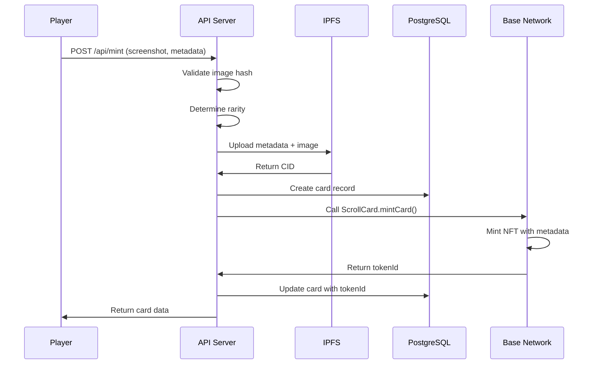
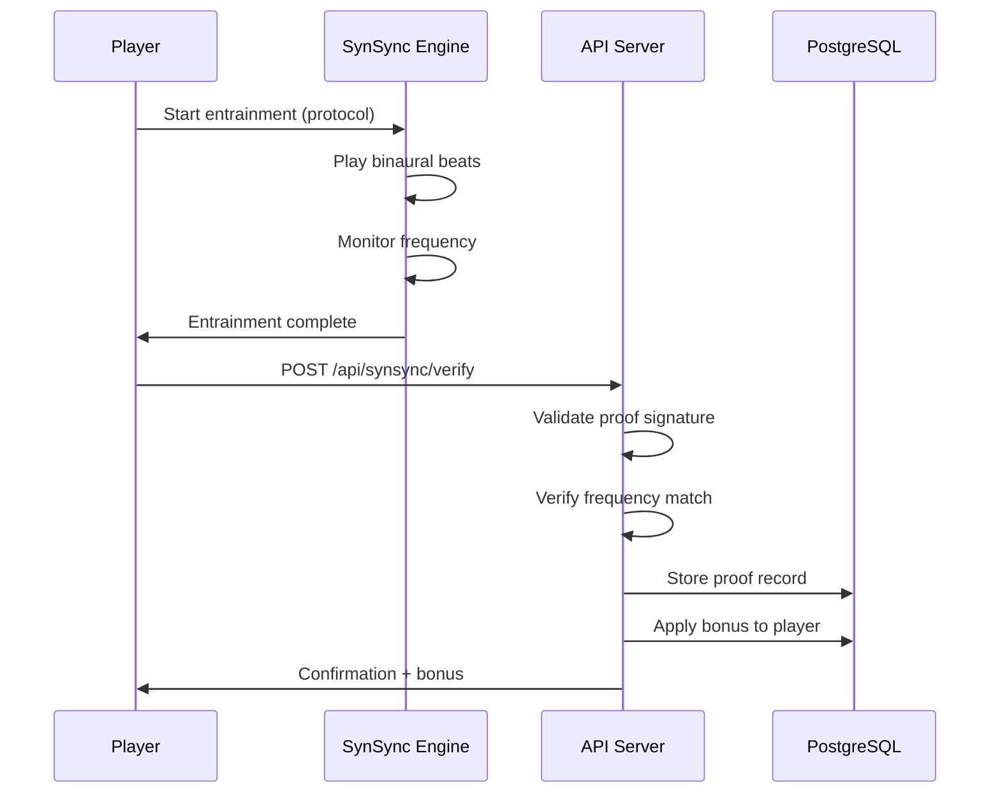
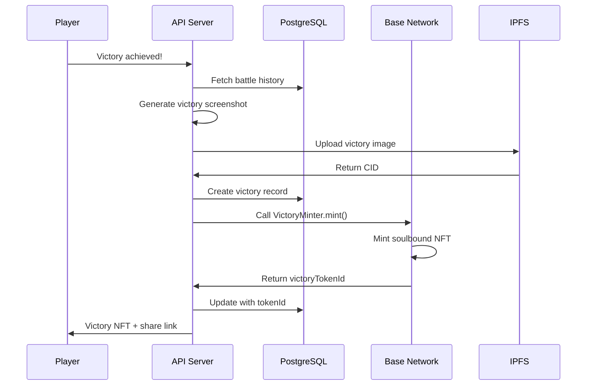

# System Architecture

This document describes the technical architecture of The Inversion Excursion, including system diagrams, data flow, and contract interactions.

---

## Table of Contents

1. [System Overview](#system-overview)
2. [Architecture Diagrams](#architecture-diagrams)
3. [Data Flow](#data-flow)
4. [Component Details](#component-details)
5. [Contract Interactions](#contract-interactions)
6. [State Management](#state-management)
7. [Security Architecture](#security-architecture)
8. [Scaling Considerations](#scaling-considerations)

---

## System Overview

The Inversion Excursion is a full-stack application with:
- **Frontend**: Next.js 14 with React Server Components
- **Backend**: Next.js API Routes with Prisma ORM
- **Database**: PostgreSQL for persistent storage
- **Cache**: Redis for rate limiting and sessions
- **Blockchain**: Base network smart contracts
- **External Services**: Farcaster, SynSync, IPFS

### Core Philosophy

The architecture follows **The Inversion** principle:
- Client-side complexity is minimized
- Server validates all game state
- Blockchain provides immutable provenance
- Database handles high-frequency game operations

---

## Architecture Diagrams

### High-Level System Architecture

```
┌─────────────────────────────────────────────────────────────────────────┐
│                              CLIENT LAYER                                │
│  ┌──────────────┐  ┌──────────────┐  ┌──────────────┐  ┌──────────────┐ │
│  │   Browser    │  │ Farcaster    │  │   Wallet     │  │  SynSync     │ │
│  │   (Next.js)  │  │   Frame      │  │  (Rabby/    │  │   Audio      │ │
│  │              │  │              │  │   Coinbase)  │  │   Engine     │ │
│  └──────┬───────┘  └──────┬───────┘  └──────┬───────┘  └──────┬───────┘ │
└─────────┼────────────────┼────────────────┼────────────────┼──────────┘
          │                │                │                │
          ▼                ▼                ▼                ▼
┌─────────────────────────────────────────────────────────────────────────┐
│                              API LAYER                                   │
│  ┌──────────────┐  ┌──────────────┐  ┌──────────────┐  ┌──────────────┐ │
│  │   Auth       │  │   Battle     │  │    Cell      │  │    Mint      │ │
│  │   (SIWE)     │  │   Engine     │  │   Formation  │  │   Cards      │ │
│  └──────┬───────┘  └──────┬───────┘  └──────┬───────┘  └──────┬───────┘ │
│  ┌──────────────┐  ┌──────────────┐  ┌──────────────┐                    │
│  │   SynSync    │  │ Leaderboard  │  │   Health     │                    │
│  │  Verification│  │              │  │   Check      │                    │
│  └──────────────┘  └──────────────┘  └──────────────┘                    │
└─────────────────────────────┬───────────────────────────────────────────┘
                              │
                              ▼
┌─────────────────────────────────────────────────────────────────────────┐
│                            SERVICE LAYER                                 │
│  ┌──────────────┐  ┌──────────────┐  ┌──────────────┐  ┌──────────────┐ │
│  │  Rate Limiter│  │    Auth      │  │   Validation │  │  Game Logic  │ │
│  │   (Redis)    │  │   Service    │  │   (Zod)      │  │   Engine     │ │
│  └──────────────┘  └──────────────┘  └──────────────┘  └──────────────┘ │
└─────────────────────────────┬───────────────────────────────────────────┘
                              │
              ┌───────────────┼───────────────┐
              ▼               ▼               ▼
┌─────────────────┐  ┌─────────────────┐  ┌─────────────────┐
│   DATABASE      │  │    BLOCKCHAIN   │  │   EXTERNAL      │
│   (PostgreSQL)  │  │    (Base L2)    │  │   SERVICES      │
│                 │  │                 │  │                 │
│  • Players      │  │  • ScrollCard   │  │  • Farcaster    │
│  • Cards        │  │  • VictoryMinter│  │  • SynSync      │
│  • Cells        │  │  • CellRegistry │  │  • IPFS         │
│  • Battles      │  │  • TradingPost  │  │  • Zora         │
│  • Actions      │  │  • Paymaster    │  │                 │
└─────────────────┘  └─────────────────┘  └─────────────────┘
```

### Battle Flow Architecture

```
┌─────────────────────────────────────────────────────────────────┐
│                     BATTLE SEQUENCE                              │
└─────────────────────────────────────────────────────────────────┘

Player 1          API Server          Database          Blockchain
   │                   │                   │                   │
   │  POST /battle/start                │                   │
   │──────────────────>│                   │                   │
   │                   │  Create Battle    │                   │
   │                   │──────────────────>│                   │
   │                   │  Battle ID        │                   │
   │                   │<──────────────────│                   │
   │  Battle State     │                   │                   │
   │<──────────────────│                   │                   │
   │                   │                   │                   │
   │  POST /battle/action               │                   │
   │──────────────────>│                   │                   │
   │                   │  Validate Action  │                   │
   │                   │  Calculate Damage │                   │
   │                   │  Update State     │                   │
   │                   │──────────────────>│                   │
   │                   │  Updated State    │                   │
   │                   │<──────────────────│                   │
   │  Updated State    │                   │                   │
   │<──────────────────│                   │                   │
   │                   │                   │                   │
   │                   │  [Victory]        │                   │
   │                   │  Mint Victory NFT │                   │
   │                   │──────────────────────────────────────>│
   │                   │                   │                   │
   │  Victory + NFT    │                   │                   │
   │<──────────────────────────────────────────────────────────│
```

### Cell Formation Flow

```
┌─────────────────────────────────────────────────────────────────┐
│                     CELL LIFECYCLE                               │
└─────────────────────────────────────────────────────────────────┘

    Create              Join               Battle              Disband
      │                   │                   │                   │
      ▼                   ▼                   ▼                   ▼
┌──────────┐        ┌──────────┐        ┌──────────┐        ┌──────────┐
│  Player  │        │  Player  │        │   Cell   │        │  Leader  │
│  (Leader)│        │  (Joiner)│        │  Members │        │  Action  │
└────┬─────┘        └────┬─────┘        └────┬─────┘        └────┬─────┘
     │                   │                   │                   │
     │ POST /cell/create │                   │                   │
     ├──────────────────>│                   │                   │
     │                   │ POST /cell/join   │                   │
     │                   ├──────────────────>│                   │
     │                   │                   │ POST /battle/start│
     │                   │                   ├──────────────────>│
     │                   │                   │                   │
     │                   │                   │ Record Battle     │
     │                   │                   │ On-chain Registry │
     │                   │                   │                   │
     │                   │                   │ POST /cell/disband│
     │                   │                   │<──────────────────│
     │                   │                   │                   │
     │ Cell Registry     │                   │                   │
     │ Smart Contract    │                   │                   │
     ├──────────────────────────────────────────────────────────>│
     │                   │                   │                   │
```

---

## Data Flow

### Card Minting Flow



### SynSync Verification Flow



### Victory Minting Flow



---

## Component Details

### Frontend Components

| Component | Purpose | Tech Stack |
|-----------|---------|------------|
| `CardFrame` | Display card with animations | React, Framer Motion |
| `BattleInterface` | Turn-based combat UI | React, WebSocket |
| `CellFormation` | Create/join Cells | React, Server Actions |
| `DeckBuilder` | Build and tune decks | React, DnD Kit |
| `SynSyncTimer` | Entrainment interface | Web Audio API |
| `VictoryModal` | Victory screenshot | html2canvas |

### API Routes

| Route | Method | Handler | Auth |
|-------|--------|---------|------|
| `/api/auth/nonce` | GET | `getNonce` | No |
| `/api/auth/verify` | POST | `verifySiwe` | No |
| `/api/cards/[id]` | GET | `getCard` | No |
| `/api/mint` | POST | `mintCard` | Yes |
| `/api/cell/create` | POST | `createCell` | Yes |
| `/api/cell/join` | POST | `joinCell` | Yes |
| `/api/battle/start` | POST | `startBattle` | Yes |
| `/api/battle/action` | POST | `submitAction` | Yes |
| `/api/synsync/verify` | POST | `verifyProof` | Yes |
| `/api/leaderboard` | GET | `getLeaderboard` | No |

### Database Schema

```prisma
// Core entities
Player {
  id, fid, address, reputation
  cards: Card[]
  cells: CellMember[]
  battles: Battle[]
}

Card {
  id, tokenId, name, metadata
  rarity, power, defense, speed
  owner: Player
  battles: BattleCard[]
}

Cell {
  id, name, emblem
  members: CellMember[]
  battles: Battle[]
  totalWins, totalBattles, reputation
}

Battle {
  id, status, currentTurn
  cell: Cell
  players: Player[]
  cards: BattleCard[]
  actions: BattleAction[]
}
```

---

## Contract Interactions

### ScrollCard.sol

```solidity
// Minting️ new ScrollCard
function mintCard(
    address to,
    Dungeon dungeon,
    Tier tier,
    Frequency frequency,
    uint8 power,
    uint8 curse,
    uint16 durability,
    uint256 dungeonSeed,
    string calldata frameUrl
) external onlyRole(MINTER_ROLE) returns (uint256);

// Card usage in battles
function useCard(uint256 tokenId, uint16 amount) external onlyRole(GAME_MASTER);

// Soulbound management
function setBinding(uint256 tokenId, bool bound) external onlyRole(TRADING_POST);

// Query functions
function getCard(uint256 tokenId) external view returns (CardAttributes memory, FrameMetadata memory);
function getCardsByOwner(address owner) external view returns (uint256[] memory);
function getEffectivePower(uint256 tokenId) external view returns (uint8);
```

### VictoryMinter.sol

```solidity
// Mint victory NFT
function mintVictory(
    address to,
    uint256 battleId,
    address[] calldata participants,
    uint256 victoryScore,
    string calldata screenshotCID,
    string calldata metadataCID,
    bytes32 battleHash,
    bytes calldata signature
) external payable returns (uint256);

// Gasless minting via paymaster
function mintVictoryGasless(...) external onlyRole(VERIFIER_ROLE);

// Frame metadata
function getFrameMetadata(uint256 tokenId) external view returns (string memory);
```

### CellRegistry.sol

```solidity
// Cell management
function formCell(string calldata name, string calldata crestCID, string calldata faction) external returns (uint256);
function joinCell(uint256 cellId) external;
function leaveCell(uint256 cellId) external;
function disbandCell(uint256 cellId) external;

// Battle recording
function recordBattle(
    uint256 cellId,
    uint256 dungeonId,
    uint256 victoryScore,
    bool isVictory,
    bytes32 battleHash,
    uint256[] calldata cardIds,
    address[] calldata participants,
    string calldata outcomeCID
) external onlyRole(BATTLE_ORACLE) returns (uint256);

// Queries
function getCell(uint256 cellId) external view returns (Cell memory);
function getCellMembers(uint256 cellId) external view returns (address[] memory);
function getTopCells(uint256 count) external view returns (uint256[] memory);
```

### TradingPost.sol

```solidity
// One-way gifting
function createGift(
    address to,
    uint256[] calldata cardIds,
    string calldata message,
    string calldata wrappingCID,
    uint256 expiresIn
) external returns (uint256);

function claimGift(uint256 giftId) external;
function refundExpiredGift(uint256 giftId) external;

// Direct gifting (no escrow)
function giftDirect(address to, uint256[] calldata cardIds, string calldata message) external;
```

### GamePaymaster.sol

```solidity
// ERC-4337 paymaster functions
function _validatePaymasterUserOp(
    UserOperation calldata userOp,
    bytes32 userOpHash,
    uint256 maxCost
) internal view override returns (bytes memory context, uint256 validationData);

function _postOp(PostOpMode mode, bytes calldata context, uint256 actualGasCost) internal override;

// Configuration
function configureSponsorship(...) external onlyRole(OPERATOR_ROLE);
function getUserRemainingOps(address user, address target) external view returns (uint256);
```

---

## State Management

### Client State

```typescript
// React Context structure
interface GameState {
  player: Player | null
  currentCell: Cell | null
  currentBattle: Battle | null
  deck: Card[]
  inventory: Card[]
  synsyncSession: SynSyncSession | null
}

// State updates via Server Actions
async function joinCell(cellId: string) {
  'use server'
  const result = await api.cell.join(cellId)
  revalidatePath('/cell')
  return result
}
```

### Server State

- **PostgreSQL**: Persistent game state
- **Redis**: Ephemeral state (rate limits, sessions)
- **Smart Contracts**: Ownership and provenance

### State Synchronization

```
Client <-> API <-> Database (primary)
               |
               <-> Blockchain (ownership)
               |
               <-> IPFS (metadata/images)
```

---

## Security Architecture

### Authentication Flow

```
1. Client requests nonce from /api/auth/nonce
2. Client signs SIWE message with wallet
3. Client sends signature to /api/auth/verify
4. Server verifies signature
5. Server issues JWT token
6. Client includes token in Authorization header
```

### Authorization Levels

| Role | Capabilities |
|------|--------------|
| `PLAYER` | Play game, mint cards, join Cells |
| `CELL_LEADER` | Manage Cell members, start battles |
| `GAME_MASTER` | Resolve disputes, emergency pause |
| `ORACLE` | Sign battle results, mint victories |
| `ADMIN` | Contract upgrades, parameter changes |

### Rate Limiting Strategy

| Endpoint | Limit | Window |
|----------|-------|--------|
| `/api/auth/*` | 5 | 1 minute |
| `/api/mint` | 3 | 5 minutes |
| `/api/battle/action` | 60 | 1 minute |
| `/api/*` (GET) | 120 | 1 minute |
| `/api/*` (POST) | 30 | 1 minute |

---

## Scaling Considerations

### Database Scaling

```sql
-- Index strategy for common queries
CREATE INDEX CONCURRENTLY idx_cards_owner ON cards(owner_id);
CREATE INDEX CONCURRENTLY idx_battles_cell ON battles(cell_id);
CREATE INDEX CONCURRENTLY idx_actions_battle ON battle_actions(battle_id);

-- Partitioning for battle_actions (by month)
CREATE TABLE battle_actions_2026_03 PARTITION OF battle_actions
    FOR VALUES FROM ('2026-03-01') TO ('2026-04-01');
```

### Caching Strategy

| Data | Cache | TTL |
|------|-------|-----|
| Card metadata | Redis | 1 hour |
| Leaderboard | Redis | 5 minutes |
| Player profile | Redis | 15 minutes |
| Battle state | In-memory | Real-time |
| Static assets | CDN | 1 day |

### Contract Optimization

- Use ERC-721A for batch minting
- Off-chain merkle proofs for airdrops
- Lazy minting for unclaimed cards
- Gasless transactions via paymaster

### Load Balancing

```
User > Cloudflare > Vercel Edge > API Server
                > Static Assets (CDN)
                > API Cache (Redis)
                > Database (Read Replicas)
```

---

*Last updated: March 2026*
