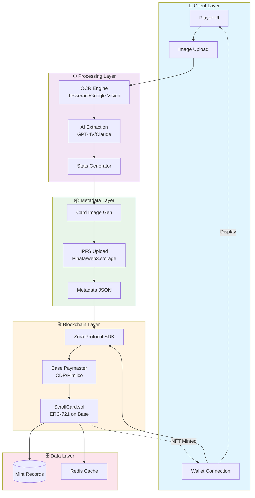
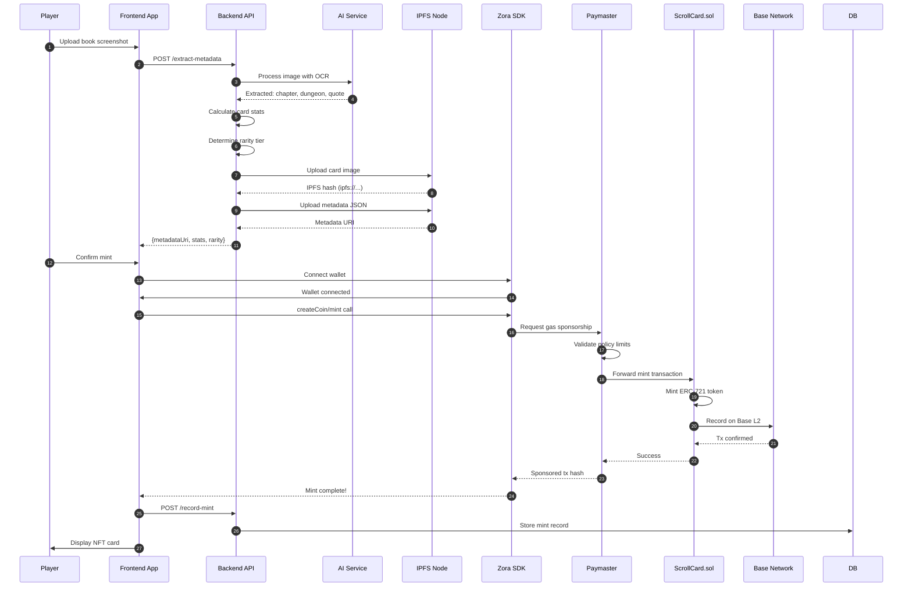
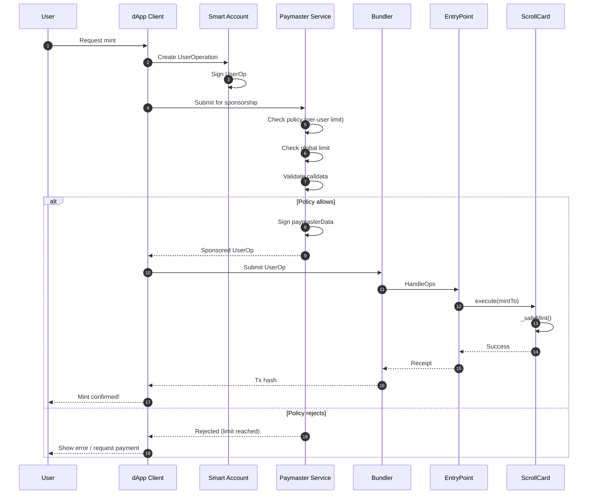
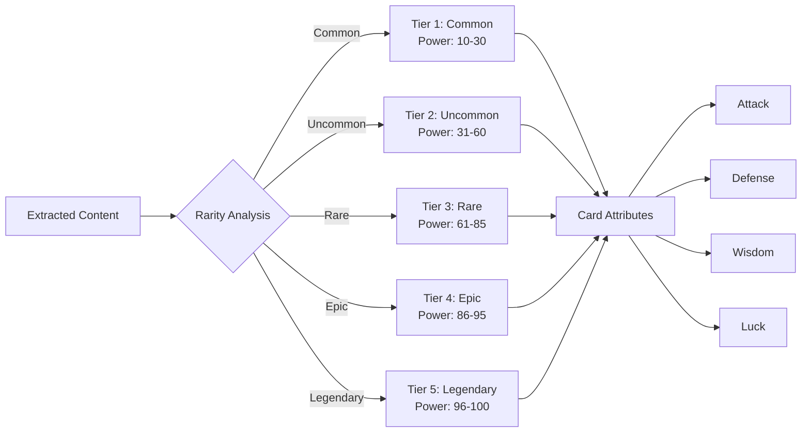
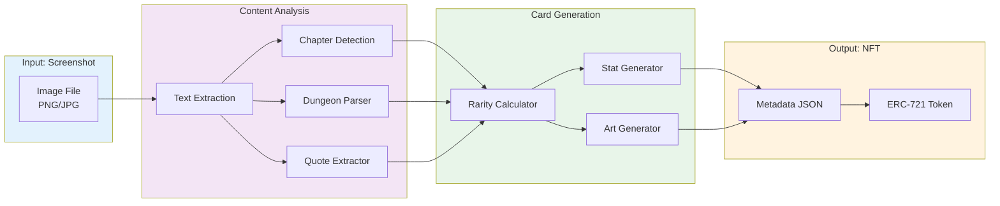
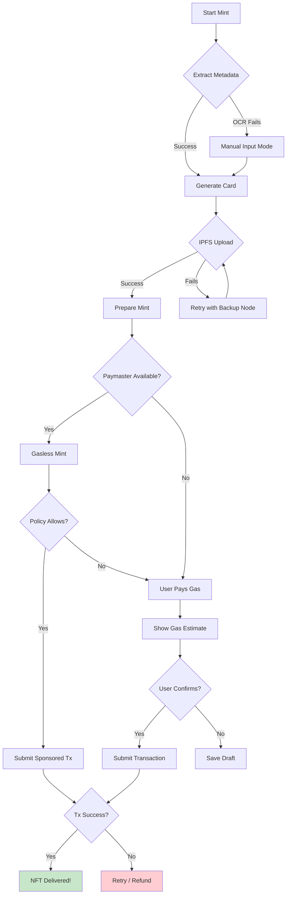

# ScrollCard Minting Flow Diagram

## System Architecture

## Detailed Minting Flow

## Gasless Minting Flow (Paymaster)

## Rarity Tiers & Stats Generation

## Data Flow: Screenshot to NFT

## Error Handling & Fallbacks

